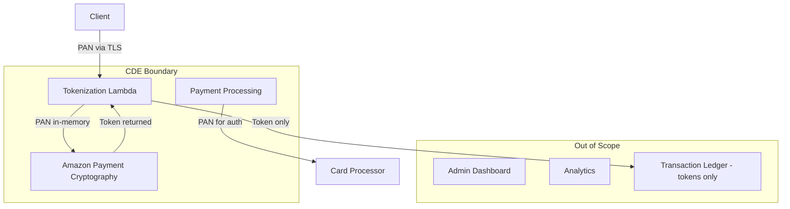
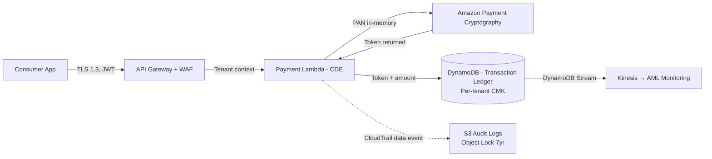
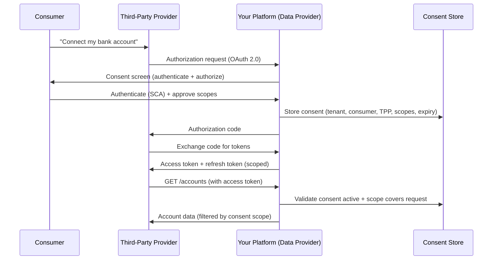
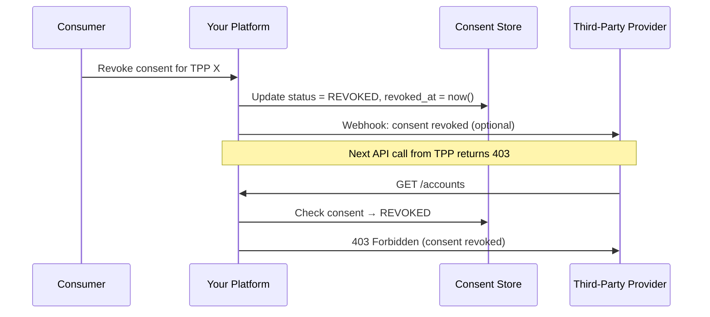

# Financial Services Architecture Artifacts

## Overview

This file defines templates for finance-specific architecture artifacts — deliverables that document compliance posture, financial data flows, and regulatory control matrices. These complement the core SaaS artifacts in `artifacts-saas.md` (HLD, Isolation Matrix, ADR, etc.).

**Load `artifacts-saas.md` alongside this file** — finance artifacts inherit readiness rules and the HLD relationship from the SaaS artifact framework.

---

## Artifact 1: PCI Scoping Matrix

Documents which services are in your Cardholder Data Environment (CDE), which are connected-to, and which are out of scope. Critical for PCI-DSS QSA assessments.

### Template

```markdown
# PCI Scoping Matrix

**Product:** {product name}
**Date:** {date}
**QSA Firm:** {if applicable}
**SAQ Type / ROC:** {SAQ A, SAQ A-EP, SAQ D, or full ROC}

## Scope Determination

| Service / Component | Category | Justification | Controls Applied |
|---|---|---|---|
| {Tokenization Lambda} | CDE (stores/processes/transmits CHD) | Receives PAN, calls Payment Cryptography for tokenization | Network isolation, per-tenant CMK, no persistent PAN storage |
| {Payment Processing ECS} | CDE | Processes authorization requests with PAN in-memory | CDE subnet, no internet access, VPC Flow Logs |
| {Amazon Payment Cryptography} | CDE (AWS-managed) | HSM operations on PAN/keys | AWS PCI responsibility, per-tenant key isolation |
| {Transaction Ledger DynamoDB} | Connected-to | Stores tokens (not PAN), connected to CDE via Lambda | IAM isolation, encryption at rest, no CHD stored |
| {Admin Dashboard} | Out of Scope | No connectivity to CDE, no CHD access | Network segmentation enforced |
| {Analytics Service} | Out of Scope | Receives only aggregated, de-identified data | No CDE network path |

## Scope Reduction Strategy
- **Tokenization point:** {where PAN is tokenized — e.g., "at API Gateway ingress via Lambda"}
- **PAN flow:** {PAN enters at X, tokenized at Y, PAN never reaches Z}
- **SAD handling:** {CVV/PIN never stored — purged immediately after auth}
- **Network segmentation:** {CDE in dedicated subnets, SGs deny non-CDE traffic}

## Network Diagram (CDE Boundary)



## Open Questions / Risks
- {Any services with ambiguous scope}
- {Planned scope changes}
```

### Readiness Requires
- Payment flow understood end-to-end
- Network architecture documented (CDE subnets identified)
- Tokenization strategy decided
- AWS services in payment path identified

---

## Artifact 2: SOX ITGC Control Matrix

Maps IT General Controls to AWS services and evidence sources. Required for public companies or SaaS vendors serving public company tenants.

### Template

```markdown
# SOX ITGC Control Matrix

**Product:** {product name}
**Date:** {date}
**Audit Period:** {fiscal year}

## Access Control (AC)

| Control ID | Control Description | AWS Implementation | Evidence Source | Testing Frequency |
|---|---|---|---|---|
| AC-01 | Unique user identification | IAM Identity Center — per-user accounts, no shared credentials | IAM user listing, Cognito user export | Quarterly |
| AC-02 | MFA for privileged access | IAM Identity Center MFA policy, Cognito MFA enforcement | MFA status report, Config rule | Monthly |
| AC-03 | Least privilege access | Permission boundaries, role-based access, no wildcard resources | IAM Access Analyzer findings, access review reports | Quarterly |
| AC-04 | Terminated user removal | Automated offboarding via tenant lifecycle events | Offboarding logs, IAM user removal evidence | Per event + quarterly review |
| AC-05 | Quarterly access review | Automated report of all users with financial system access | Access review sign-off artifacts | Quarterly |

## Change Management (CM)

| Control ID | Control Description | AWS Implementation | Evidence Source | Testing Frequency |
|---|---|---|---|---|
| CM-01 | Formal change approval | CodePipeline manual approval gate, PR approvals | Pipeline execution history, PR merge records | Per change |
| CM-02 | Segregation of duties | Developers cannot deploy to production (IAM restrictions) | IAM policies, deployment role configuration | Quarterly |
| CM-03 | Testing before production | Automated tests in CI/CD, staging environment validation | Test execution reports, pipeline logs | Per change |
| CM-04 | Emergency change process | Documented break-glass deployment with post-hoc review | Break-glass audit trail, review sign-offs | Per event |

## Availability and Recovery (AR)

| Control ID | Control Description | AWS Implementation | Evidence Source | Testing Frequency |
|---|---|---|---|---|
| AR-01 | Backup of financial data | AWS Backup cross-region, DynamoDB PITR, Aurora snapshots | Backup job completion reports | Daily (automated) |
| AR-02 | DR testing | Quarterly failover test, documented results | DR test reports with outcomes | Quarterly |
| AR-03 | Availability monitoring | CloudWatch alarms, uptime metrics per service | Monthly availability reports | Monthly |

## Audit Logging (AL)

| Control ID | Control Description | AWS Implementation | Evidence Source | Testing Frequency |
|---|---|---|---|---|
| AL-01 | Comprehensive audit trail | CloudTrail management + data events for all production accounts | CloudTrail configuration evidence | Annual review |
| AL-02 | Log integrity | S3 Object Lock Compliance Mode, CloudTrail log file validation | Object Lock configuration, validation status | Annual review |
| AL-03 | Log retention (7 years) | S3 lifecycle policy + Object Lock retention period | Bucket configuration evidence | Annual review |
| AL-04 | Log review | CloudWatch Insights queries, Security Hub dashboards | Review evidence (screenshots, exports) | Monthly |
```

### Readiness Requires
- AWS account structure documented
- CI/CD pipeline established
- IAM governance model defined
- Backup strategy implemented

---

## Artifact 3: AML Risk Assessment

Documents the platform's BSA/AML risk assessment for each tenant tier.

### Template

```markdown
# AML Risk Assessment

**Product:** {product name}
**Date:** {date}
**BSA Officer:** {name}

## Risk Categories

| Category | Risk Factors | Platform Mitigation | Residual Risk |
|---|---|---|---|
| Customer Type | {MSBs, foreign correspondents, PEPs} | KYC/KYB verification, enhanced due diligence for high-risk | {Low/Medium/High} |
| Geographic | {High-risk jurisdictions per FATF} | OFAC screening, geo-blocking, enhanced monitoring | {Low/Medium/High} |
| Product/Service | {International wires, virtual currency, prepaid} | Transaction limits, velocity monitoring, real-time screening | {Low/Medium/High} |
| Transaction Volume | {High-value, rapid movement, structuring patterns} | CTR automation, structuring detection rules | {Low/Medium/High} |

## Monitoring Rules (Per Tenant Tier)

| Rule | Threshold | Escalation |
|---|---|---|
| Single transaction > $X | {configurable per tenant} | Auto-alert to analyst queue |
| Daily aggregate > $10,000 (cash) | $10,000 (regulatory) | CTR filing queue |
| Velocity: > N transactions in T minutes | {per tenant config} | Fraud + AML alert |
| Geographic anomaly | Transaction from FATF high-risk country | Hold + alert |
| Structuring pattern | Multiple transactions $8K-$9.9K in 24hrs | Auto-alert, priority |

## Technology Controls

| Control | Implementation | Effectiveness Metric |
|---|---|---|
| Real-time OFAC screening | Lambda at transaction initiation, SDN list refreshed every 6 hours | Screen rate: 100%, false positive rate: < 2% |
| Transaction monitoring | Kinesis + rules engine + SageMaker scoring | Alert-to-SAR conversion rate |
| CTR automation | Daily aggregation per customer, auto-filing | Filing timeliness: 100% within 15 days |
| Case management | Step Functions workflow, per-tenant isolation | Average case resolution time |
```

### Readiness Requires
- BSA/AML obligations confirmed for the platform
- Transaction monitoring rules defined
- OFAC screening implemented
- Filing workflows operational

---

## Artifact 4: Financial Data Flow Map

Shows how financial PII and cardholder data flows through the system with encryption and access control annotations at each hop.

### Template

```markdown
# Financial Data Flow Map

**Product:** {product name}
**Date:** {date}

## Data Flow Diagram



## Data Classification at Each Hop

| Hop | Data Present | Encryption | Access Control | Audit |
|---|---|---|---|---|
| Consumer → API Gateway | PAN, amount, merchant | TLS 1.3 | WAF rate limiting, JWT validation | API Gateway access logs |
| API Gateway → CDE Lambda | PAN (in request body) | In-transit (VPC internal) | IAM + CDE subnet SG | CloudTrail invoke event |
| CDE Lambda → Payment Crypto | PAN for tokenization | TLS to VPC endpoint | IAM role scoped to CDE | CloudTrail API event |
| CDE Lambda → DynamoDB | Token (NOT PAN), amount | Per-tenant CMK (SSE-KMS) | IAM session policy (LeadingKeys) | CloudTrail data event |
| DynamoDB → AML Monitoring | Token, amount, metadata | Stream encryption (CMK) | IAM on Kinesis consumer | Stream consumer logs |
```

### Readiness Requires
- Payment/data flow understood end-to-end
- Encryption strategy confirmed per hop
- CDE boundary defined
- Tenant isolation mechanism identified per data store

---

## Artifact 5: Open Banking Consent Flow

Sequence diagram documenting the consumer consent journey for FDX/Section 1033/PSD2.

### Template

```markdown
# Open Banking Consent Flow

**Product:** {product name}
**Date:** {date}
**Standard:** {FDX / PSD2 / Section 1033}

## Consent Grant Flow



## Consent Revocation Flow



## Consent Data Model

| Field | Value |
|---|---|
| Tenant | {financial institution tenant ID} |
| Consumer | {consumer identifier within tenant} |
| TPP | {third-party provider identifier} |
| Scopes | {fdx:transactions:read, fdx:balances:read} |
| Duration | {90 days from grant} |
| Status | {active / revoked / expired} |
```

### Readiness Requires
- Open banking standard identified (FDX, PSD2, Section 1033)
- OAuth 2.0 flow designed
- Consent data model defined
- Revocation mechanism implemented

---

## Artifact 6: Adverse Action Notice Design

Documents the architecture for generating ECOA/FCRA-compliant adverse action notices from AI/ML credit decisions.

### Template

```markdown
# Adverse Action Notice Design

**Product:** {product name}
**Date:** {date}

## Decision-to-Notice Pipeline

| Step | Component | Input | Output |
|---|---|---|---|
| 1 | Credit Decisioning Engine | Application data + bureau score | Decision: Approve/Deny/Counter |
| 2 | Explainability Engine (SHAP) | Model features + decision | Top 4 contributing factors |
| 3 | Reason Code Mapper | SHAP factors | CFPB standard reason codes |
| 4 | Notice Generator | Reason codes + applicant info + score | Formatted adverse action notice |
| 5 | Delivery Service | Notice document | Sent via {email/mail/in-app} |
| 6 | Audit Logger | All above | Immutable record retained 5 years |

## Required Notice Content (ECOA/FCRA)
- Specific reasons for adverse action (up to 4, from CFPB model form B-1)
- Credit score used and score range
- Credit bureau name and contact information
- Statement of consumer rights (FCRA §615)
- CFPB contact information

## Reason Code Mapping (Sample)

| Model Feature | CFPB Reason Code | Consumer-Facing Text |
|---|---|---|
| debt_to_income_ratio | 19 | "Debt-to-income ratio is too high" |
| delinquency_count | 38 | "Number of accounts with delinquency" |
| credit_history_length | 14 | "Length of time accounts have been established" |
| inquiries_last_6mo | 08 | "Too many inquiries in the last 12 months" |
```

### Readiness Requires
- Credit decisioning model deployed
- Explainability mechanism implemented (SHAP/LIME)
- Feature-to-reason-code mapping documented
- Notice template reviewed by legal/compliance
- Delivery mechanism configured per tenant

---

## Artifact 7: Data Processing Agreement (DPA) Inventory

Tracks all third-party data processors and their agreements — equivalent of healthcare's BAA Inventory.

### Template

```markdown
# Data Processing Agreement Inventory

**Product:** {product name}
**Date:** {date}
**Last Review:** {date}

## Processor Inventory

| Processor | Data Shared | Purpose | DPA Status | PCI Scope? | SOC 2? | Review Date |
|---|---|---|---|---|---|---|
| AWS | All financial data | Cloud infrastructure | Executed (DPA addendum) | Yes (Level 1 SP) | Yes (Type II) | Annual |
| {Payment Processor} | PAN, transaction data | Card authorization | Executed | Yes (Level 1) | Yes | Annual |
| {Credit Bureau} | Consumer PII, SSN | Credit report pull | Executed | No | Yes | Annual |
| {KYC Provider} | Identity documents | Identity verification | Executed | No | Yes | Annual |
| {OFAC Screening} | Counterparty names | Sanctions screening | Executed | No | Yes | Annual |

## Gap Analysis
- {Any processor without a current DPA}
- {Any processor without SOC 2 or equivalent assurance}
- {Any processor with expired agreement needing renewal}
```

### Readiness Requires
- Complete list of third-party data processors
- DPA/contract status for each
- PCI scope determination for each
- Review schedule established
