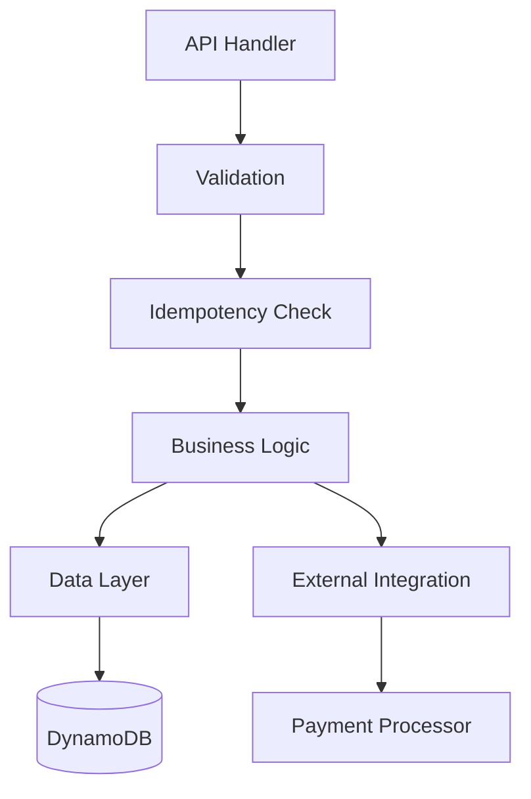
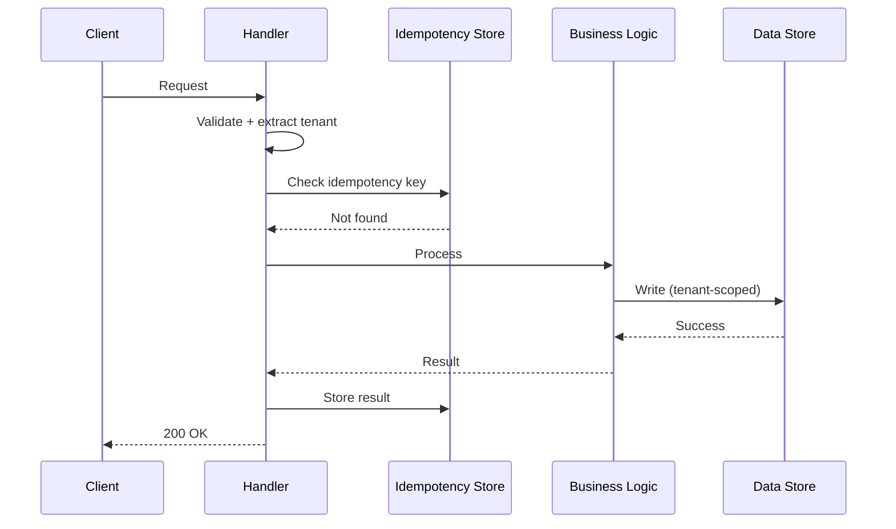

# Low-Level Design (LLD) Artifacts

## Overview

A Low-Level Design (LLD) is a per-component detail document that sits beneath the High-Level Design (HLD). The HLD lists components at one paragraph each; each significant component gets its own LLD covering internal structure, public API contracts, data model, algorithms, sequence diagrams, and tenant isolation implementation.

**Prerequisites:** Always generate the HLD before any LLD. The LLD references the HLD for system context.

---

## When to Generate an LLD

- A team is about to implement or refactor a specific component
- A component has complex internal logic that needs documentation (payment processing, credit decisioning, AML pipeline)
- Architecture review reveals a component that is inadequately documented
- SOX change control requires design documentation before implementation
- PCI QSA needs to understand the internal workings of a CDE component

---

## LLD Template

```markdown
# Low-Level Design: {Component Name}

**Product:** {product name}
**Component:** {component name}
**HLD Reference:** [HLD](./high-level-design.md) — Section {N}
**Date:** {date}
**Version:** {version}
**Owner:** {team/person}

## 1. Purpose and Scope

{What this component does, what it does NOT do, and its boundaries within the system.}

**In scope:** {list}
**Out of scope:** {list — handled by other components}

## 2. API Contract

### Endpoints

| Method | Path | Purpose | Auth |
|---|---|---|---|
| POST | /v1/{resource} | {description} | JWT + tenant context |
| GET | /v1/{resource}/{id} | {description} | JWT + tenant context |

### Request/Response Schemas

```json
// POST /v1/payments — Request
{
  "idempotency_key": "string (required)",
  "amount": "number (required, > 0)",
  "currency": "string (ISO 4217, required)",
  "source_token": "string (payment token, required)",
  "destination": { ... }
}
```

### Error Codes
| Code | Meaning | Retry? |
|---|---|---|
| 400 | Invalid request | No |
| 409 | Duplicate idempotency key (already processed) | No — return original result |
| 429 | Rate limited | Yes — with backoff |
| 500 | Internal error | Yes — with backoff |

## 3. Internal Architecture

### Component Diagram



### Key Internal Modules
| Module | Responsibility |
|---|---|
| Validation | Input schema validation, tenant context extraction |
| Idempotency | DynamoDB conditional write for deduplication |
| Business Logic | Core processing rules, per-tenant configuration |
| Data Layer | DynamoDB access with tenant-scoped credentials |

## 4. Data Model

### Tables / Schemas

| Table | PK | SK | Purpose |
|---|---|---|---|
| {TableName} | TENANT#{tenant_id} | {sort key pattern} | {purpose} |

### Key Access Patterns
| Pattern | Query | Frequency |
|---|---|---|
| Get by ID | PK = TENANT#X, SK = ITEM#Y | High |
| List by date range | PK = TENANT#X, SK between DATE#A and DATE#B | Medium |

## 5. Tenant Isolation

- **Data isolation:** {IAM LeadingKeys / RLS / Separate table}
- **Compute isolation:** {Shared Lambda with session policy / Dedicated ECS task}
- **Encryption:** {Per-tenant CMK for data at rest}
- **Testing:** {Automated cross-tenant access test in CI/CD}

## 6. Sequence Diagrams

### Primary Flow (Happy Path)



## 7. Error Handling and Resilience

| Failure Mode | Detection | Response | Recovery |
|---|---|---|---|
| External service timeout | HTTP timeout (5s) | Return 503, DLQ message | Retry with exponential backoff |
| DynamoDB throttle | ThrottlingException | Retry (SDK built-in) | Auto-resolves |
| Invalid tenant context | JWT validation failure | Return 401 | None — client must re-authenticate |

## 8. Observability

### Metrics Emitted
| Metric | Type | Dimensions |
|---|---|---|
| {component}.requests | Counter | tenant_id, status_code |
| {component}.latency | Histogram | tenant_id, operation |
| {component}.errors | Counter | tenant_id, error_type |

### Log Events
| Event | Level | When |
|---|---|---|
| REQUEST_RECEIVED | INFO | Every request (no PII) |
| PROCESSING_COMPLETE | INFO | Successful processing |
| EXTERNAL_CALL_FAILED | ERROR | Integration failure |

## 9. Security Considerations

- {PCI scope: is this component in the CDE?}
- {Input validation: what injection risks exist?}
- {Secrets: how are credentials managed?}
- {Access: who can invoke this component?}

## 10. Related Artifacts
- [HLD](./high-level-design.md)
- [Tenant Isolation Matrix](./tenant-isolation-matrix.md)
- [ADR-{N}](./adr/ADR-{N}.md) — relevant decision
```

---

## Readiness Requires

Do not generate an LLD without:
- HLD exists (the component is listed in it)
- Component boundaries clear (what's in scope, what's not)
- API contract decided (endpoints, request/response shapes)
- Data model decided (tables, key design, access patterns)
- Tenant isolation approach confirmed for this component
- Integration points identified (what external services does it call?)

If any of these are missing, ask for them before generating.
