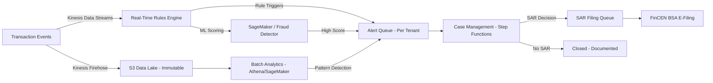
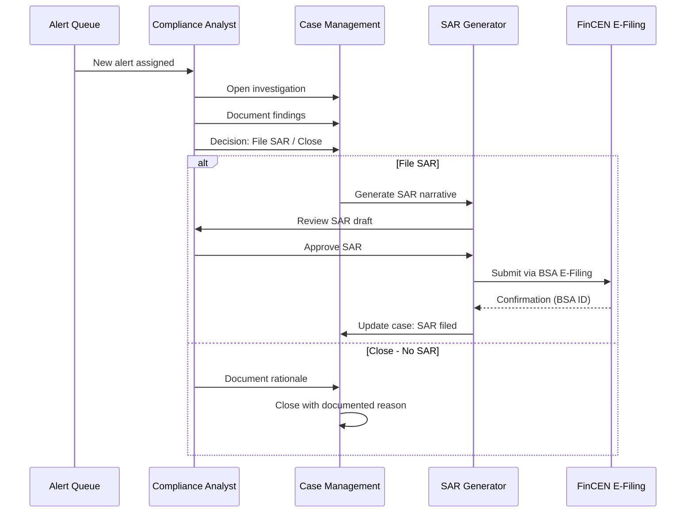

# Fraud Detection & AML

## Why This File Exists

Financial institutions have a legal obligation to detect, prevent, and report financial crimes. BSA/AML compliance is not optional — failure results in consent orders, civil money penalties (millions), and potential criminal liability for individuals. This file covers the architecture of fraud detection and anti-money laundering systems on AWS for multi-tenant financial services SaaS.

---

## AML Program Architecture

### The Four BSA/AML Pillars
1. **Internal policies, procedures, and controls** — documented AML program
2. **Designated BSA Officer** — individual responsible for program compliance
3. **Ongoing employee training** — documented, periodic
4. **Independent testing** — annual audit by qualified third party

Your SaaS platform enables pillars 1 and 4 by providing the technology infrastructure for transaction monitoring, alert management, SAR filing, and audit evidence.

### Transaction Monitoring Pipeline



### Key Architectural Requirements
- **Immutability:** Transaction events must be immutable once written — S3 with Object Lock or DynamoDB append-only. Regulators need the complete unaltered transaction history.
- **Per-tenant isolation:** Alert queues, case files, and SAR decisions are strictly per-tenant. One tenant's compliance investigation must NEVER be visible to another tenant.
- **Tipping-off prohibition:** SAR filings are confidential. The system must not reveal to the subject (or to other tenants) that a SAR has been filed. No notifications, no status changes visible to the subject.
- **Audit trail:** Every alert, disposition decision, escalation, and SAR filing must be logged with who/when/why.

---

## SAR (Suspicious Activity Report) Filing

### Filing Requirements
- File with FinCEN within 30 calendar days of detection (60 days if no suspect identified)
- SAR covers activity above $5,000 involving potential money laundering, BSA violations, or other suspicious patterns
- Must include: transaction details, subject information, narrative describing suspicious activity
- Retention: 5 years from date of filing

### Architecture for SAR Workflow



**Multi-tenant:** Each tenant has their own alert queue, case management instances, and SAR filing credentials. SAR filing is done under the financial institution's (tenant's) FinCEN registration — not your platform's.

---

## CTR (Currency Transaction Report)

### Architecture
- Aggregate cash transactions per customer per calendar day
- Detect $10,000 threshold crossing (single transaction OR aggregate)
- Structuring detection: multiple transactions just below $10K to avoid reporting

```typescript
// CTR threshold detection — runs per tenant, per customer, daily
async function checkCTRThreshold(tenantId: string, customerId: string, date: string) {
  const dailyTotal = await dynamodb.query({
    TableName: 'CashTransactions',
    KeyConditionExpression: 'pk = :pk AND begins_with(sk, :date)',
    ExpressionAttributeValues: {
      ':pk': `TENANT#${tenantId}#CUSTOMER#${customerId}`,
      ':date': `DATE#${date}`,
    },
  });
  
  const totalAmount = dailyTotal.Items.reduce((sum, item) => sum + item.amount, 0);
  
  if (totalAmount >= 10000) {
    await sqsClient.send(new SendMessageCommand({
      QueueUrl: `https://sqs.../ctr-filing-${tenantId}`,
      MessageBody: JSON.stringify({ tenantId, customerId, date, totalAmount }),
    }));
  }
  
  // Structuring detection: multiple transactions $8K-$9.9K in a short window
  const suspiciousPattern = dailyTotal.Items.filter(t => t.amount >= 8000 && t.amount < 10000);
  if (suspiciousPattern.length >= 2) {
    await generateAlert(tenantId, customerId, 'POSSIBLE_STRUCTURING', suspiciousPattern);
  }
}
```

### Filing Requirements
- File within 15 calendar days of the transaction
- Exemption management: record Phase I/II exempt customers with audit trail
- Retention: 5 years from date of filing

---

## OFAC Sanctions Screening

### Real-Time Screening Architecture

```
Payment Initiation Request
    ↓
Lambda: Extract counterparty info (name, address, country)
    ↓
OFAC Screening Service (Lambda + DynamoDB/ElastiCache)
    ↓
┌──────────┬───────────────┬──────────────┐
│  Clear    │  Potential     │  Match       │
│  (pass)   │  (fuzzy match) │  (block)     │
└────┬─────┴───────┬───────┴──────┬───────┘
     ↓             ↓              ↓
  Continue    Manual Review    Block Payment
  Payment     Queue            + Alert Compliance
```

### SDN List Management
- OFAC publishes the SDN (Specially Designated Nationals) list in multiple formats (XML, CSV, delimited)
- Updates occur frequently — sometimes multiple times per week
- **Architecture:** Lambda on a schedule (every 6 hours) downloads and parses the latest SDN list → stores in DynamoDB or ElastiCache for sub-millisecond screening
- **Fuzzy matching:** Names are not always exact matches. Implement Levenshtein distance, phonetic matching (Soundex/Metaphone), and configurable match threshold (typically 80-90% similarity)
- **Multi-tenant:** Screening logic is shared (pool), but match results and disposition decisions are per-tenant

### Batch Screening
- Nightly full-customer-base re-screening against updated OFAC lists
- New designations can match existing customers who were clean at onboarding
- Results routed to per-tenant compliance alert queues
- Step Functions workflow for match disposition

---

## Amazon Fraud Detector

AWS's managed ML-based fraud detection service. Use for real-time transaction fraud scoring.

### Multi-Tenant Patterns

**Shared Model (Pool):**
Train one fraud model on aggregated (anonymized) data across all tenants. Score transactions for any tenant.
- **Pros:** More training data = better model, lower cost, simpler operations
- **Cons:** Model may not capture tenant-specific patterns, data leakage risk between competitors
- **When to use:** Platform-level fraud detection where tenants consent to shared analytics

**Per-Tenant Model (Silo):**
Each tenant has their own trained model using only their transaction data.
- **Pros:** No data leakage, captures tenant-specific fraud patterns, tenant owns their model
- **Cons:** Less training data per model (cold start problem for new tenants), higher cost
- **When to use:** Large institutions with sufficient data, competing tenants, tenants who require data isolation for model training

**Hybrid:**
Shared base model (trained on aggregated data) + per-tenant fine-tuning layer.
- **Pros:** Benefits of shared data for base patterns + tenant-specific customization
- **When to use:** Most multi-tenant fintech platforms

### Real-Time Scoring Pipeline
```
Transaction → API Gateway → Lambda → Amazon Fraud Detector (GetEventPrediction)
                                              ↓
                              Score: 0-1000 (risk score)
                                              ↓
                         ┌────────────────────┴────────────────────┐
                         ↓                                         ↓
                   Score < 300                              Score >= 700
                   (Low Risk)                              (High Risk)
                   → Approve                              → Block + Alert
                                    ↓
                              300-699 (Medium)
                              → Step-up auth or manual review
```

---

## Model Risk for Fraud and AML Models (SR 11-7 / SR 26-2)

If your fraud or AML models are used by a bank tenant, they may fall under model risk management requirements:

**When SR 11-7/SR 26-2 applies:**
- Model output directly influences a decision with material financial impact (block a transaction, generate a SAR alert)
- Model is used by a Federal Reserve, OCC, or FDIC-supervised institution

**Architecture implications:**
- **Model inventory:** Track all models (version, purpose, validation status, owner) in a model registry
- **Validation:** Independent validation of model performance (not the team that built it)
- **Ongoing monitoring:** Track model performance metrics (precision, recall, false positive rate) per tenant
- **Champion-challenger:** Run new model versions in shadow mode before promoting to production
- **Documentation:** Model development documentation, validation report, ongoing monitoring report

See `genai-and-financial-data.md` for detailed model risk architecture.

---

## Case Management and Investigation Workflow

### Architecture
- **Alert triage:** Automated scoring + rules determine priority
- **Assignment:** Round-robin or skill-based assignment to compliance analysts
- **Investigation:** Analyst reviews transaction history, customer profile, screening results
- **Decision:** File SAR, close with documentation, or escalate
- **Tracking:** Every action timestamped, attributed to specific analyst, stored immutably

### Multi-Tenant Case Management
- Cases are STRICTLY per-tenant — no cross-tenant visibility
- Each tenant's compliance team sees only their cases
- Platform operators (your team) should have limited access — only for technical support, with audit trail
- Case data retention: 5 years after case closure (matches SAR retention)

---

## Common Mistakes

1. **AML monitoring as a batch-only process.** Real-time transaction monitoring is expected by examiners. Batch detection (nightly/weekly) supplements but does not replace real-time alerting.

2. **No tuning evidence.** FinCEN examiners look for evidence that thresholds and rules are tuned based on performance data. Document every threshold change, false positive rate, and tuning decision.

3. **Cross-tenant alert visibility.** One tenant's SAR alert appearing in another tenant's queue is a confidentiality violation AND a tipping-off risk. Strict per-tenant isolation on all AML data.

4. **OFAC screening only at onboarding.** New designations happen weekly. Screen at onboarding AND at every outbound payment AND batch re-screen existing customers.

5. **Fraud model data leakage between competing tenants.** If Tenant A's transaction patterns influence Tenant B's fraud model, and they're competitors, that's a data sharing violation. Use per-tenant or hybrid models with strict training data isolation.

6. **No SAR filing evidence trail.** Every SAR must have a documented investigation: why it was filed, who made the decision, what evidence supports it. An auditor will ask for this.

---

## Discovery Questions for This Domain

**AML program:**
- Are your tenants BSA-obligated (banks, MSBs, broker-dealers)?
- Do you provide transaction monitoring or do tenants bring their own AML system?
- What's the expected transaction volume per tenant for monitoring purposes?
- Do tenants need SAR/CTR filing capability through your platform?

**Fraud detection:**
- Do you need real-time fraud scoring on transactions?
- Are you using Amazon Fraud Detector, a third-party service, or custom models?
- Do competing tenants share fraud model training data, or is it strictly isolated?

**OFAC:**
- Do you screen counterparties against OFAC SDN list?
- Is screening real-time (at transaction) or batch (nightly)?
- How do you handle fuzzy matches (potential but not confirmed matches)?

**Model risk:**
- Are any of your tenants Federal Reserve, OCC, or FDIC supervised?
- If yes: are your fraud/AML models in their model inventory? Are they validated per SR 11-7/SR 26-2?
- Do you track model performance metrics (false positive rate, detection rate) per tenant?

---

## References

- [FinCEN BSA/AML Statutes and Regulations](https://www.fincen.gov/resources/statutes-regulations/bank-secrecy-act)
- [FinCEN SAR Filing Instructions](https://www.fincen.gov/resources/filing-information)
- [OFAC SDN List](https://ofac.treasury.gov/specially-designated-nationals-and-blocked-persons-list-sdn-human-readable-lists)
- [Amazon Fraud Detector Developer Guide](https://docs.aws.amazon.com/frauddetector/latest/ug/what-is-frauddetector.html)
- [Federal Reserve SR 11-7 (Model Risk Management)](https://www.federalreserve.gov/supervisionreg/srletters/sr1107.htm)
- [FFIEC BSA/AML Examination Manual](https://bsaaml.ffiec.gov/manual)
- [AWS Financial Services — Fraud Prevention](https://aws.amazon.com/financial-services/fraud-detection/)
