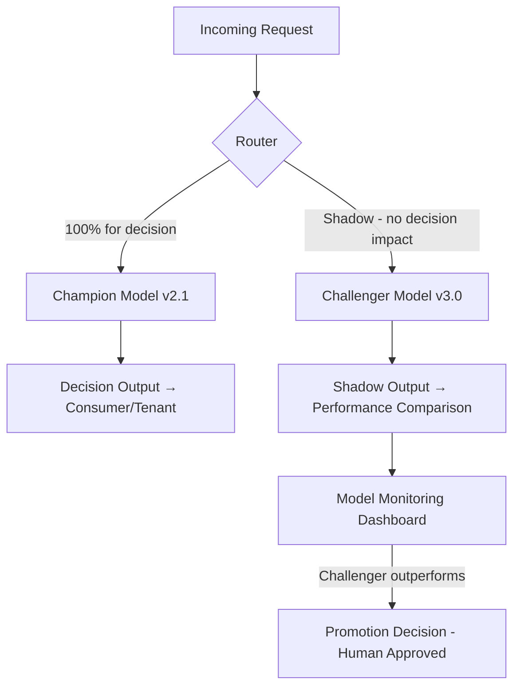

# GenAI & Financial Data

## Why This File Exists

Generative AI in financial services is not just a technology decision — it's a regulatory one. AI/ML models that influence financial decisions (credit, fraud, trading, advisory) are subject to model risk management requirements (SR 11-7 / SR 26-2). GenAI that processes consumer financial data is subject to GLBA, FCRA, and PCI-DSS depending on the data type. This file covers how to architect AI/ML workloads on AWS for multi-tenant financial services SaaS with proper governance.

---

## GenAI Use Cases in Financial Services

| Use Case | Input Data | Regulatory Concern | Model Risk? |
|---|---|---|---|
| Credit memo drafting | Loan application, bureau data | GLBA, FCRA | Yes — output influences credit decision |
| Adverse action narrative | Denial reasons, applicant data | ECOA, FCRA | Yes — consumer-facing regulatory output |
| Fraud narrative generation | Transaction patterns, alert data | BSA/AML | Yes — supports SAR filing |
| Document extraction (loan apps) | Scanned financial documents | GLBA | Depends — if extraction drives decisioning |
| KYC document verification | Identity documents | BSA/AML, GLBA | Low — augments human review |
| Regulatory reporting assistance | Compliance data, regulations | SOX, BSA | Low — human review required |
| Customer service chatbot | Account info, transaction history | GLBA, PCI-DSS (if card data) | Low — if not making decisions |
| Robo-advisory recommendations | Portfolio, market data, risk profile | SEC/FINRA suitability | Yes — investment recommendation |
| Trade idea generation | Market data, research | FINRA communications rules | Yes — if client-facing |

---

## AWS Bedrock for Financial Services

### GLBA/PCI Scope Considerations
- Bedrock does NOT train on customer data (per AWS data handling policy)
- Bedrock is NOT yet PCI-DSS-eligible — do NOT send PAN to Bedrock
- Bedrock IS GLBA-eligible for financial PII processing (non-PAN)
- Enable Bedrock model invocation logging → CloudWatch Logs for audit trail

### Dual-Zone Architecture

Separate the system into two zones to manage regulatory exposure:

```
┌─────────────────────────────────────────────────┐
│  Financial Data Zone (persists PII/financial data)│
│  - DynamoDB (loan data, account data, credit)    │
│  - S3 (financial documents)                      │
│  - Per-tenant KMS CMK encryption                 │
│  - Full GLBA/SOX/PCI controls apply              │
└──────────────────────┬──────────────────────────┘
                       │ De-identified or minimized prompt
                       ↓
┌─────────────────────────────────────────────────┐
│  AI Zone (inference only — no persistent         │
│  financial data storage)                         │
│  - Bedrock (invoke model, no training)           │
│  - Lambda (prompt construction, response parse)  │
│  - No PAN, no SSN in prompts                     │
│  - Invocation logs retained for audit            │
│  - Output is financial PII → return to Data Zone │
└─────────────────────────────────────────────────┘
```

**Key principle:** The AI Zone processes financial data transiently but does not persist it. All persistent storage of financial PII (including AI-generated outputs like credit memos) happens in the Financial Data Zone with full encryption and access controls.

### Per-Tenant Model Isolation

**Amazon Bedrock custom models:**
- Fine-tune per tenant (tenant's data stays isolated — no cross-tenant training data)
- Model artifacts stored in per-tenant S3 bucket
- Inference endpoints can be shared (pool) with per-tenant prompt routing
- Or dedicated provisioned throughput per tenant (silo for high-volume/low-latency)

**Bedrock Guardrails (per tenant):**
- Configure guardrails per tenant to prevent: PII leakage, unauthorized financial advice, non-compliant outputs
- Deny topics: specific financial advice (unless tenant is a licensed advisor), specific investment recommendations (FINRA)
- Content filters: block PAN patterns, SSN patterns in outputs

---

## SR 11-7 / SR 26-2 — Model Risk Governance for AI/ML

### When Model Risk Management Applies

A "model" under SR 11-7 is any quantitative method, system, or approach that applies statistical, economic, financial, or mathematical theories to process input data into quantitative estimates.

**Key test:** Does the model output directly or indirectly influence a decision with material financial impact? If yes → model risk management applies.

### Model Risk Management Framework on AWS

```
┌─────────────────────────────────────────────┐
│  Model Inventory (DynamoDB)                  │
│  - Model ID, version, purpose, owner         │
│  - Regulatory tier (SR 11-7 / non-regulated) │
│  - Validation status, next review date       │
│  - Per-tenant: which tenants use this model  │
└──────────────────────┬──────────────────────┘
                       │
┌──────────────────────┴──────────────────────┐
│  Model Lifecycle                             │
│                                              │
│  Development → Validation → Deployment →     │
│  Monitoring → Revalidation (annual or on     │
│  material change)                            │
└─────────────────────────────────────────────┘
```

### Required Documentation Per Model

| Document | Content | Retention |
|---|---|---|
| Model Development Documentation | Data sources, methodology, assumptions, limitations, performance metrics | Life of model + 5 years |
| Validation Report | Independent assessment of model soundness, limitations, usage appropriateness | Life of model + 5 years |
| Implementation Documentation | How model is deployed, versioned, inputs validated, outputs consumed | Current version |
| Ongoing Monitoring Report | Performance metrics over time, stability analysis, benchmark comparison | Quarterly or semi-annually |
| Change Control Record | Every model change: what changed, why, re-validation required? | Life of model + 5 years |

### Champion-Challenger Pattern



**Multi-tenant:** Each tenant may have a different champion model version. Model promotion from challenger to champion requires per-tenant approval (the regulated lender's model risk committee, not your platform team).

### Monitoring Metrics

| Metric | Purpose | Alert Threshold |
|---|---|---|
| PSI (Population Stability Index) | Detect input data drift | > 0.25 = significant shift |
| Gini / KS statistic | Model discriminatory power | > 10% decline from validation |
| Default rate (actual vs predicted) | Calibration accuracy | > 15% deviation |
| Approval rate by protected class | Fair lending (ECOA) | Statistically significant disparity |
| False positive rate (fraud) | Operational efficiency | > 20% increase from baseline |
| Adverse action reason accuracy | ECOA compliance | Any misattributed reason |

---

## RAG for Internal Financial Knowledge Bases

### Use Case
Financial institutions need AI that can answer questions about their own regulations, policies, product rules, and compliance procedures — without hallucinating.

### Per-Tenant RAG Architecture

```
Tenant A's Knowledge Base (S3)        Tenant B's Knowledge Base (S3)
├── compliance-policies/               ├── compliance-policies/
├── product-rules/                     ├── product-rules/
├── regulatory-guidance/               ├── regulatory-guidance/
└── procedure-manuals/                 └── procedure-manuals/
         ↓                                      ↓
    Bedrock Knowledge Base A              Bedrock Knowledge Base B
    (embeddings in OpenSearch              (embeddings in OpenSearch
     Serverless - Collection A)            Serverless - Collection B)
         ↓                                      ↓
    Tenant A queries → RAG →              Tenant B queries → RAG →
    Tenant A knowledge only               Tenant B knowledge only
```

**Critical isolation requirement:** Tenant A's RAG must NEVER return content from Tenant B's knowledge base. Use separate Bedrock Knowledge Bases per tenant (or separate OpenSearch collections with strict IAM-based access control).

---

## Prompt Injection Risks in Financial Applications

### Threat Scenarios
- User submits a loan application with prompt injection in a text field → AI extraction pipeline executes unintended instructions
- Customer chatbot manipulated to reveal other customers' account information
- Fraud narrative generator manipulated to omit suspicious details from SAR supporting documentation

### Mitigations
- **Input sanitization:** Strip or escape prompt-like patterns from user-supplied content before including in prompts
- **Bedrock Guardrails:** Enable input/output content filters, deny unauthorized topics
- **Output validation:** AI-generated financial outputs (credit memos, adverse action reasons) must be validated against business rules before delivery
- **Human-in-the-loop:** For regulated outputs (SAR narratives, adverse action notices), require human review before finalization
- **Least-privilege prompts:** Only include the minimum financial data needed in the prompt — not the consumer's entire file

---

## Explainability for ECOA/Reg B Compliance

When AI drives credit decisions, ECOA requires specific, actionable adverse action reasons. For ML models, this requires post-hoc explainability.

### AWS Tools for Explainability
- **SageMaker Clarify:** SHAP-based explainability for tabular models — generates feature importance per prediction
- **Bedrock Guardrails:** Cannot provide ECOA-level explainability (LLMs don't produce feature-level attribution natively)
- **Custom SHAP/LIME:** For complex models, implement SHAP or LIME to extract per-decision feature contributions

### Mapping Model Features to Adverse Action Reason Codes
- CFPB publishes standard adverse action reason codes (e.g., "38 - Number of accounts with delinquency")
- Your explainability pipeline must map model feature importance → standardized reason codes
- This mapping must be documented and reviewed as part of model validation (SR 11-7)

---

## Common Mistakes

1. **Sending PAN to Bedrock.** Bedrock is NOT PCI-DSS eligible. Never include cardholder data in prompts. Tokenize or mask before prompt construction.

2. **GenAI credit decisions without explainability.** An LLM-generated "approve" or "deny" with no feature-level explanation violates ECOA. Always pair GenAI with an explainability mechanism.

3. **No model inventory for AI/ML.** If bank examiners ask "what models do you have, what are they used for, and when were they last validated?" and you can't answer, that's a finding.

4. **Shared RAG knowledge base across competing tenants.** Tenant A's internal compliance policies appearing in Tenant B's RAG responses is a confidentiality breach. Strict per-tenant knowledge base isolation.

5. **No human-in-the-loop for regulated outputs.** SAR narratives, adverse action notices, and investment recommendations generated by AI must have human review before delivery. Fully automated regulated outputs without human oversight create regulatory risk.

6. **Champion-challenger without tenant approval.** Promoting a new model version for a regulated lender tenant without their model risk committee's approval violates their internal governance (and SR 11-7).

---

## Discovery Questions for This Domain

**AI/ML usage:**
- What AI/ML models do you use in your platform? (Credit scoring, fraud detection, document extraction, chatbot, advisory?)
- Do any models directly influence credit decisions, fraud alerts, or investment recommendations?
- Are you using AWS Bedrock, SageMaker, or third-party AI services?

**Model risk:**
- Are any tenants bank-supervised (Fed, OCC, FDIC) — triggering SR 11-7/SR 26-2?
- Do you maintain a model inventory? Is each model documented and validated?
- How are models monitored in production? (Performance drift, fairness metrics)

**Data handling:**
- Does financial PII (SSN, account numbers, credit data) enter AI prompts?
- Is PAN ever included in prompts or model inputs? (Must not be — PCI scope)
- Do you use per-tenant RAG knowledge bases, or is knowledge shared?

**Explainability:**
- For credit models: can you generate per-decision adverse action reasons?
- Do you use SHAP, LIME, or another explainability technique?
- Are adverse action reasons mapped to CFPB standard codes?

---

## References

- [Federal Reserve SR 11-7 — Model Risk Management](https://www.federalreserve.gov/supervisionreg/srletters/sr1107.htm)
- [Amazon Bedrock — Security and Compliance](https://docs.aws.amazon.com/bedrock/latest/userguide/security.html)
- [Amazon SageMaker Clarify — Explainability](https://docs.aws.amazon.com/sagemaker/latest/dg/clarify-model-explainability.html)
- [CFPB — Adverse Action Notice Requirements](https://www.consumerfinance.gov/rules-policy/regulations/1002/c/)
- [ECOA / Regulation B — AI/ML Guidance](https://www.consumerfinance.gov/about-us/blog/cfpb-acts-to-protect-the-public-from-black-box-credit-models-using-complex-algorithms/)
- [AWS Bedrock Knowledge Bases](https://docs.aws.amazon.com/bedrock/latest/userguide/knowledge-base.html)
- [Responsible AI on AWS](https://aws.amazon.com/machine-learning/responsible-ai/)
