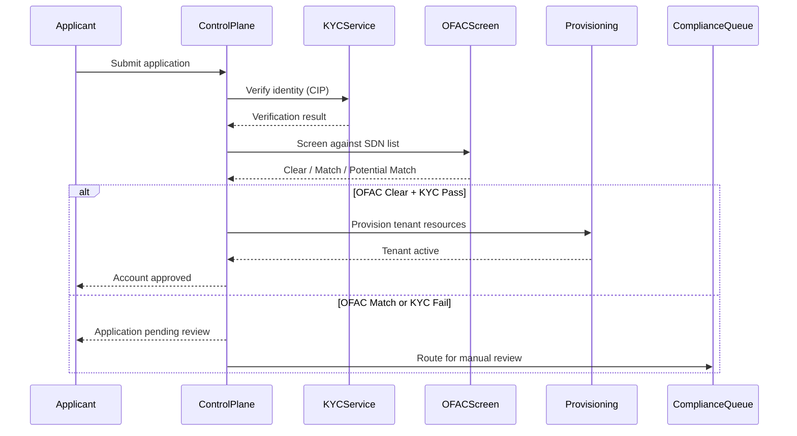

# Identity, Onboarding & Tenant Lifecycle

## SaaS Identity: The Tenant-User Binding

The SaaS Lens defines "SaaS identity" as the binding of a user identity to a tenant context. Every authenticated user must be associated with a tenant. In financial services SaaS this binding is critical because it determines: which financial data the user can access, which regulatory tier applies, what KYC/KYB status gates their actions, and which AML monitoring rules apply.

### How Tenant Context Flows in Financial Services

1. User authenticates → identity provider issues JWT with tenant ID + regulatory context
2. API Gateway validates JWT → extracts tenant context
3. Service uses tenant context to scope data access (IAM session policies)
4. AML monitoring, audit logging, and metering all key off tenant context
5. Every downstream call, message, and async invocation carries tenant context

## KYC/KYB Onboarding — The Finance-Specific Gate

In financial services SaaS, tenant onboarding isn't just "create account, provision resources." It requires regulatory identity verification before the tenant can transact.

### KYC (Know Your Customer) — Consumer/Individual
Required by BSA/AML for any customer relationship involving financial transactions:
- **CIP (Customer Identification Program):** Collect name, DOB, address, SSN (or equivalent)
- **Identity verification:** Verify identity against government-issued documents or databases
- **OFAC screening:** Screen against SDN list before account opening
- **Ongoing monitoring:** Re-screen periodically and on trigger events

### KYB (Know Your Business) — Entity/Organization
When your tenant is a business entity:
- **Entity verification:** Confirm legal existence (state registration, EIN)
- **Beneficial ownership:** Identify individuals with 25%+ ownership (FinCEN BOI reporting)
- **Controller identification:** Identify one individual with significant management responsibility
- **OFAC screening:** Screen entity AND all beneficial owners
- **Risk assessment:** Assign initial BSA/AML risk tier (low/medium/high)

### Onboarding Architecture with KYC/KYB Gate



**Key architecture requirements:**
- KYC/KYB status stored per tenant in the control plane — gates all financial operations until verified
- OFAC screening must complete BEFORE any financial activity is enabled
- Document storage (uploaded IDs, formation documents) encrypted with per-tenant KMS key
- KYC verification results retained for 5 years after relationship termination (BSA requirement)
- Ongoing OFAC re-screening: batch nightly + real-time at transaction for counterparties

## Strong Customer Authentication (SCA)

### FFIEC Authentication Guidance
The FFIEC Authentication and Access to Financial Institution Services guidance (updated 2021) requires:
- MFA for all digital banking customers accessing account information or initiating transactions
- Risk-based authentication: adjust authentication requirements based on transaction risk
- Layered security controls beyond passwords: device authentication, behavioral analytics, step-up challenges

### PSD2 Strong Customer Authentication (EU/UK)
If your SaaS serves EU/UK markets, PSD2 SCA requirements apply:
- Two of three factors required: knowledge (password/PIN), possession (phone/token), inherence (biometric)
- SCA required for: accessing payment account online, initiating electronic payment, any remote action with risk of fraud
- Exemptions: low-value transactions (<€30), recurring payments (same amount/payee), whitelisted beneficiaries

### Cognito Implementation for SCA

```typescript
// Custom authentication challenge for step-up SCA
const createAuthChallenge: CreateAuthChallengeTrigger = async (event) => {
  if (event.request.challengeName === 'CUSTOM_CHALLENGE') {
    const transactionAmount = event.request.clientMetadata?.transactionAmount;
    const riskScore = event.request.clientMetadata?.riskScore;
    
    // Determine SCA requirement based on risk
    if (parseFloat(transactionAmount) > 10000 || riskScore === 'HIGH') {
      // Require biometric or hardware token for high-value/high-risk
      event.response.publicChallengeParameters = { type: 'BIOMETRIC_OR_TOKEN' };
    } else {
      // Standard MFA (TOTP or SMS) for lower risk
      event.response.publicChallengeParameters = { type: 'MFA_TOTP' };
    }
  }
  return event;
};
```

## OAuth 2.0 / OIDC for Open Banking

When your SaaS platform provides open banking APIs (FDX, PSD2), OAuth 2.0 is the mandatory authorization framework. See `open-banking-and-interop.md` for full coverage; this section covers identity-specific aspects.

### FDX OAuth 2.0 Model
- Financial institution (your tenant) is the Authorization Server
- Third-party provider (TPP) is the Client
- Consumer is the Resource Owner
- Your platform hosts the Resource Server (financial data APIs)

**JWT scopes for FDX:**
- `fdx:accountdetail:read` — read account details
- `fdx:transactions:read` — read transaction history
- `fdx:accountbalance:read` — read balances
- Duration-limited: consent expires after a defined period (90 days default for FDX)

### PSD2 TPP Authentication
- TPPs must be registered with their national competent authority (NCA)
- eIDAS certificates (QWAC and QSeal) required for TPP identification
- mTLS between TPP and your platform's API — see `api-gateway-and-networking.md`

## JWT Claims for Financial Services

The JWT should include finance-specific claims beyond standard SaaS claims:

```json
{
  "sub": "user-12345",
  "custom:tenant_id": "tenant-abc123",
  "custom:tenant_tier": "professional",
  "custom:regulatory_tier": "bank_chartered",
  "custom:kyc_status": "verified",
  "custom:kyb_status": "verified",
  "custom:account_type": "commercial",
  "custom:roles": ["treasury_admin", "payment_initiator"],
  "custom:transaction_limit": "100000",
  "custom:mfa_verified": true,
  "iat": 1719849600,
  "exp": 1719853200
}
```

**Finance-specific claims:**
- `regulatory_tier` — bank_chartered, broker_dealer, credit_union, fintech, msb (determines which steering applies)
- `kyc_status` — pending, verified, expired, failed (gates financial operations)
- `transaction_limit` — per-user transaction approval limit (Verified Permissions enforces)
- `mfa_verified` — whether current session has MFA (required for financial operations per FFIEC)


## Financial Services Identity Personas

### Persona 1: Institution Administrator (Bank CTO, Fintech Platform Admin)
- **Authentication:** Federated from the institution's corporate IdP (Okta, Entra ID, Ping) via SAML/OIDC. MFA mandatory.
- **Session:** Standard web sessions with inactivity timeout (30 min per FFIEC).
- **Access:** Tenant configuration, user management, compliance settings, reporting. Should NOT have direct access to individual customer transaction data.
- **Cognito:** User pool per tenant (Pattern 2) for enterprise banks; single pool with SAML federation (Pattern 3) for mid-market.

### Persona 2: Operations User (Loan Officer, Payment Operator, Compliance Analyst)
- **Authentication:** Username/password + MFA (TOTP or hardware token). May federate from institution IdP.
- **Session:** Shift-based sessions, step-up authentication for high-value operations.
- **Access:** Operational access to financial data within their role and their tenant. Transaction approval limits apply. AML analysts access alert queues.
- **Cognito:** Same pool as admin, different Cognito group with role-based permissions.

### Persona 3: End Consumer (Account Holder, Borrower, Investor)
- **Authentication:** Self-service registration with KYC verification gate. Email/phone + MFA.
- **Session:** Longer sessions for portal access, but step-up SCA for transactions per FFIEC/PSD2.
- **Access:** Their own financial data only. Initiate transactions within their account limits. Grant/revoke open banking consent.
- **Cognito:** Separate app client or separate user pool from institutional users.

### Persona 4: Third-Party Provider (Open Banking TPP, API Consumer)
- **Authentication:** OAuth 2.0 client credentials with mTLS. eIDAS certificates for PSD2 TPPs.
- **Session:** Token-based, no interactive session. Access token scoped by consumer consent.
- **Access:** Consumer-consented financial data only. Read-only for AIS, payment initiation for PIS.
- **Cognito:** Not typically Cognito — API Gateway with custom Lambda authorizer validating OAuth tokens and consent.

## Tenant Onboarding — Fully Automated with Compliance Gates

### What Onboarding Must Do (Finance-Adapted)

| Step | Action | Finance Addition |
|---|---|---|
| 1 | Create tenant record | Include regulatory_tier, jurisdiction, BSA risk tier |
| 2 | KYC/KYB verification | **NEW** — verify identity before any financial operations |
| 3 | OFAC screening | **NEW** — screen against sanctions lists |
| 4 | Provision identity | Create user pool or configure SAML federation |
| 5 | Provision storage | Per-tenant DynamoDB tables, RDS schema, S3 buckets, KMS keys |
| 6 | Configure CDE access | **NEW** — if tenant processes cards, provision CDE token namespace |
| 7 | Configure AML monitoring | **NEW** — set up tenant-specific alert rules and thresholds |
| 8 | Set up billing | Create billing profile, configure metering |
| 9 | Apply tier limits | API Gateway usage plan, transaction volume caps |
| 10 | Compliance documentation | **NEW** — generate DPA, record regulatory agreements |
| 11 | Send activation | Notify tenant, provide access |

**Orchestration:** Step Functions — each step is a Lambda with retry logic and compensation (rollback).

### Per-Tier Onboarding Variations

| Step | Starter (Pool) | Professional (Bridge) | Enterprise (Silo) |
|---|---|---|---|
| KYC/KYB | Automated verification | Automated + manual review for high-risk | White-glove onboarding with compliance team |
| Provision storage | Shared (pool partition) | Per-tenant tables/schemas | Dedicated account or VPC |
| CDE setup | Shared CDE, tenant token namespace | Shared CDE, dedicated token vault partition | Dedicated CDE possible |
| AML monitoring | Shared rules, tenant-scoped alerts | Per-tenant rule thresholds | Per-tenant model configuration |
| Estimated time | ~30 seconds (after KYC clear) | ~2 minutes | ~10 minutes (manual steps may add days) |

## Tenant Lifecycle Management

### Tenant States (Finance-Specific)

| State | Description | Financial Operations | Data |
|---|---|---|---|
| Pending KYC | Application received, verification in progress | **Blocked** — no financial ops | Application data only |
| Active | Verified, operational | Enabled per tier limits | Full access |
| Suspended (compliance) | BSA/AML concern or regulatory hold | **Blocked** — freeze all transactions | Preserved, under investigation |
| Suspended (payment) | Payment failure | Blocked | Preserved for grace period |
| Deactivated | Churned or terminated | Blocked | Preserved for retention period |
| Archived | Past retention period | Blocked | Cold storage or cryptographic erasure |

**Finance-specific lifecycle events:**
- **Compliance suspension:** FinCEN/regulator request or internal SAR trigger can freeze a tenant. This MUST be immediate — no grace period, no notice to tenant (tipping off prohibition for SAR-related freezes).
- **Regulatory retention:** GLBA requires 5 years, SEC 17a-4 requires 6 years for broker-dealers, SOX requires 7 years for financial records. Key deletion (cryptographic erasure) is gated on these retention periods.

## Consent Management for Open Banking

### FDX Consent Model
When end consumers grant a TPP access to their financial data:
- Consent is time-limited (90-day default, renewable)
- Consent is scope-limited (specific account types, specific data categories)
- Consumer can revoke consent at any time — revocation takes effect immediately
- Consent status must be checked on every API call from the TPP

### Architecture Pattern
1. Consumer grants consent via your platform's consent UI (not the TPP's UI — per FDX/Section 1033)
2. Consent stored in DynamoDB with tenant_id + consumer_id + tpp_id + scope + expiry
3. OAuth token issued to TPP with scopes matching the consent grant
4. API Gateway custom authorizer validates: token valid + consent active + scope covers request
5. Consent dashboard: consumer can view all active consents and revoke any

See `open-banking-and-interop.md` for full consent architecture.

## Common Mistakes

1. **Allowing financial operations before KYC/KYB clears.** BSA requires identity verification before establishing a customer relationship. If your onboarding flow provisions a tenant and enables transactions before verification, you have a compliance gap.

2. **No step-up authentication for high-value transactions.** FFIEC guidance requires risk-based authentication. A user who logged in an hour ago should face a step-up challenge before moving $500K.

3. **Shared accounts in production.** PCI-DSS Requirement 8 and SOX ITGC both require unique user identification. Shared "service accounts" with human access are a finding.

4. **Not propagating tenant context in async flows.** If an SQS message triggers a transaction and the message doesn't carry tenant_id, downstream processing can't enforce isolation or attribute the transaction.

5. **KYC documents stored without encryption.** Uploaded IDs, formation documents, and beneficial ownership records are financial PII — per-tenant KMS CMK encryption required.

6. **Open banking consent not checked at request time.** Consent can be revoked at any time. Checking only at token issuance is insufficient — validate consent status on every data access request.

## Discovery Questions for This Domain

**Identity:**
- What identity provider are you using? (Cognito, Auth0, Okta, custom?)
- Do institutional tenants need SAML/OIDC federation from their corporate IdP?
- Do you have distinct personas? (Institution admin, operations, end consumer, TPP?)
- Do consumers authenticate directly, or through a partner/bank portal?

**KYC/KYB:**
- How do you verify tenant identity today? (Manual review? Automated CIP? Third-party KYC service?)
- Are you screening against OFAC SDN list at onboarding? At transaction time?
- Do you collect and verify beneficial ownership for entity tenants?
- What's your KYC/KYB data retention policy?

**Authentication strength:**
- Is MFA required for all financial operations? (FFIEC guidance says yes)
- Do you implement step-up authentication for high-value transactions?
- If PSD2 applies: are you implementing SCA with two-factor requirements?

**Open banking:**
- Do you issue OAuth tokens to third-party providers? (FDX, PSD2 TPPs?)
- How do you manage consumer consent lifecycle (grant, revoke, expire, renew)?
- Is consent validated on every API request, or only at token issuance?

## References

- [SaaS Lens — Identity and Access Management](https://docs.aws.amazon.com/wellarchitected/latest/saas-lens/identity-and-access-management.html)
- [FFIEC Authentication and Access Guidance (2021)](https://www.ffiec.gov/guidance/Authentication-and-Access-to-Financial-Institution-Services-and-Systems.pdf)
- [FDX API Standard — Authorization](https://financialdataexchange.org/)
- [CFPB Section 1033 — Personal Financial Data Rights](https://www.consumerfinance.gov/personal-financial-data-rights/)
- [FinCEN CDD / Beneficial Ownership Rule](https://www.fincen.gov/resources/statutes-regulations/cdd-final-rule)
- [PSD2 — Strong Customer Authentication (EBA RTS)](https://www.eba.europa.eu/regulation-and-policy/payment-services-and-electronic-money/regulatory-technical-standards-on-strong-customer-authentication-and-common-and-secure-communication)
- [SaaS Authentication with Amazon Cognito](https://aws.amazon.com/blogs/security/saas-authentication-identity-management-with-amazon-cognito-user-pools/)
- [Tenant Onboarding Best Practices with the SaaS Lens](https://aws.amazon.com/blogs/apn/tenant-onboarding-best-practices-in-saas-with-the-aws-well-architected-saas-lens/)
