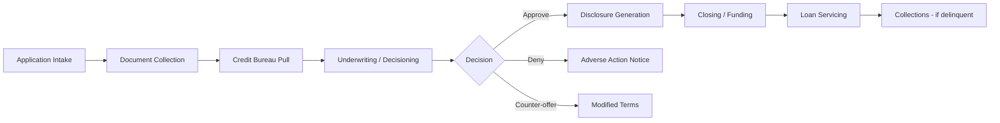
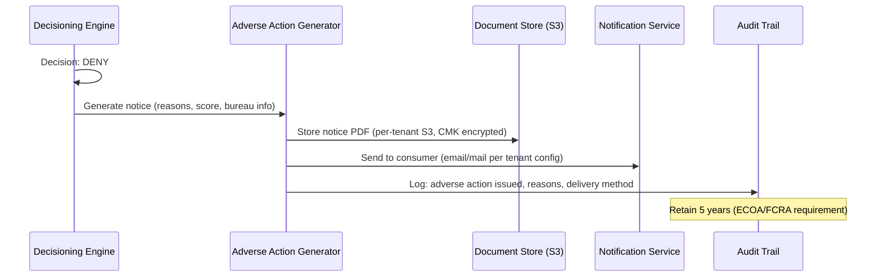

# Lending & Credit

## Segment Overview

Lending SaaS includes multi-tenant platforms for loan origination, credit decisioning, loan servicing, collections, and BNPL (Buy Now Pay Later). Tenants are lenders — banks, credit unions, fintech lenders, BNPL providers, and mortgage companies. The core workload is moving a loan application from intake through underwriting, decisioning, closing, and ongoing servicing.

This segment has unique regulatory requirements: FCRA (credit reporting), ECOA/Reg B (fair lending), TILA/Reg Z (truth in lending), RESPA (mortgage servicing), and SR 11-7/SR 26-2 model risk for credit scoring models.

---

## Loan Origination System (LOS) Architecture

### End-to-End Loan Lifecycle



### Multi-Tenant LOS Architecture

```
Application Intake API (shared compute - Lambda/ECS)
    → Per-tenant DynamoDB (application data)
    → Per-tenant S3 (uploaded documents - KYC, pay stubs, tax returns)
    → Step Functions (orchestrate loan workflow per tenant's product configuration)
    → Credit Bureau API (Equifax/Experian/TransUnion - per tenant credentials)
    → Decisioning Engine (SageMaker - per tenant model or shared model)
    → Per-tenant DynamoDB (loan records, decisioning output)
    → Document Generation (Lambda - disclosures, adverse action notices)
    → Per-tenant S3 (generated documents - signed, retained)
```

**Key multi-tenant requirements:**
- Each lender tenant has their own loan products with different terms, rates, and eligibility criteria
- Credit bureau credentials are per-tenant (each lender has their own bureau subscription)
- Underwriting rules and models are per-tenant (a bank and a BNPL provider have very different risk appetites)
- Loan data is highly sensitive — bridge or silo isolation mandatory

---

## Credit Decisioning Pipeline

### Bureau Data Integration

```
Loan Application (consumer data)
    → Lambda: Construct bureau request (per tenant's bureau credentials)
    → API call to Equifax/Experian/TransUnion
    → Response: Credit report + score
    → DynamoDB: Store report (encrypted, per-tenant CMK)
    → Log: Permissible purpose documented (FCRA requirement)
```

**FCRA Permissible Purpose:**
Every credit bureau pull MUST have a documented permissible purpose (e.g., "credit transaction initiated by consumer"). Your platform must:
- Log the permissible purpose for every bureau pull
- Associate it with the specific application
- Retain for 5 years after the account is closed
- Make available if disputed by the consumer

### Scorecard / Model Architecture

**Rule-Based Scoring (Traditional):**
- Decision table or decision tree per tenant
- Each tenant configures their own cutoff scores, eligibility criteria, and product assignment rules
- Stored as versioned configuration in DynamoDB (per tenant)
- Changes require approval workflow (SOX change control if tenant is public company)

**ML-Based Credit Scoring:**
- SageMaker model trained on tenant's historical loan performance data
- Per-tenant model (data isolation for model training — one lender's data cannot train another's model)
- Model version tracked in model registry (SageMaker Model Registry)
- SR 11-7 / SR 26-2 model risk: validation, documentation, ongoing monitoring required
- See `genai-and-financial-data.md` for model risk architecture

### ECOA / Reg B — Fair Lending Requirements

The Equal Credit Opportunity Act prohibits discrimination in lending based on race, color, religion, national origin, sex, marital status, age, or receipt of public assistance.

**Architecture implications for AI/ML credit models:**
- **Explainability:** Every credit denial must cite specific, actionable reasons. "The model said no" is not acceptable.
- **Disparate impact testing:** Models must be tested for discriminatory outcomes across protected classes before deployment AND monitored in production
- **Adverse action reasons:** Generate specific factors that contributed to the denial (e.g., "High debt-to-income ratio", "Limited credit history")
- **SHAP/LIME values:** Use explainability techniques (SHAP, LIME) to extract feature importance per decision for adverse action compliance

```python
# Example: Generate adverse action reasons from model output
import shap

def generate_adverse_action_reasons(model, application_features, top_n=4):
    """Generate ECOA-compliant adverse action reasons using SHAP."""
    explainer = shap.TreeExplainer(model)
    shap_values = explainer.shap_values(application_features)
    
    # Get features that most negatively impacted the score
    negative_contributions = sorted(
        zip(feature_names, shap_values[0]),
        key=lambda x: x[1]  # Most negative first
    )
    
    # Map to consumer-friendly reason codes (per CFPB adverse action reason standards)
    reason_codes = []
    for feature_name, impact in negative_contributions[:top_n]:
        reason_codes.append(FEATURE_TO_REASON_CODE[feature_name])
    
    return reason_codes  # e.g., ["38 - Number of accounts with delinquency", "14 - Length of time accounts have been established"]
```

---

## Adverse Action Notice Architecture

### When Required
- Consumer denied credit, insurance, or employment based on a consumer report
- Must be sent within 30 days of the adverse action
- Must include: specific reasons for denial (up to 4), credit score used, score range, bureau contact info, CFPB notice

### Automated Adverse Action Pipeline



### Multi-Tenant Adverse Action
- Each tenant has their own adverse action notice template (branded, compliant with their legal review)
- Reason codes are standardized (CFPB model forms) but the notice design varies per tenant
- Delivery method (email, postal mail, in-app) is per-tenant configuration
- All notices retained per-tenant for 5 years (ECOA) — per-tenant S3 bucket with Object Lock

---

## TILA / Reg Z — Truth in Lending

### Disclosure Requirements
- APR (Annual Percentage Rate) — must be calculated accurately per Reg Z Appendix J
- Finance charge — total cost of credit
- Amount financed — net amount of credit provided
- Total of payments — total amount consumer will pay
- Payment schedule — timing and amount of each payment

**Architecture:** Disclosure calculation engine (Lambda) that implements Reg Z APR calculation. Versioned and tested — an APR calculation error is a TILA violation. Per-tenant product configuration (rates, fees, terms) drives the calculation inputs.

---

## BNPL (Buy Now Pay Later) Architecture

### BNPL-Specific Patterns
- Short-term installment plans (4 payments over 6 weeks — may not require full credit pull)
- Real-time decisioning at point of sale (< 2 seconds end-to-end)
- High volume, low dollar amount — pool model more appropriate than silo
- Multi-merchant: your BNPL platform serves many merchant tenants

### Architecture
```
Merchant Checkout → API Gateway → Lambda (BNPL Decision)
    → Soft credit check or proprietary scoring
    → Decision in < 500ms
    → If approved: create installment plan in DynamoDB
    → Return approval to merchant
    → Schedule payment collection (SQS + scheduler)
```

---

## Loan Servicing

### Core Servicing Functions
- Payment processing (monthly payments, extra payments, payoffs)
- Escrow administration (taxes, insurance — for mortgages)
- Statement generation (monthly, annual)
- Delinquency management (late fees, cure notices, default)
- Modification and deferral (forbearance, rate changes, term extensions)
- Investor reporting (for securitized loans — per PSA/pooling agreement)

### Multi-Tenant Servicing
- Each lender tenant has their own servicing rules (late fee amounts, grace periods, cure periods)
- Payment processing ties to `payments-and-ledger.md` — ACH collection per tenant
- Statement generation per tenant (branded templates)
- Investor reporting per tenant (different investors, different formats)

---

## SR 11-7 / SR 26-2 Model Risk for Credit Models

**What triggers model risk governance:**
- ML credit scoring model
- Income estimation model
- Property valuation model (AVMs)
- Fraud scoring model used in credit decisions
- Any model where output materially impacts a credit decision

**Required documentation (per model):**
- Model development documentation (data, methodology, assumptions, limitations)
- Model validation report (independent team validates performance)
- Ongoing monitoring report (model performance over time, stability, accuracy)
- Implementation documentation (how the model is deployed, versioned, rolled back)

See `genai-and-financial-data.md` for detailed model risk architecture.

---

## Common Mistakes

1. **Credit decisions without explainability.** If you can't tell a consumer WHY they were denied in specific, actionable terms, you're violating ECOA/FCRA. "Model score too low" is not an acceptable adverse action reason.

2. **Shared credit scoring model across competing lender tenants.** One lender's loan performance data training a model that scores another lender's applicants creates data leakage concerns. Per-tenant models (or strictly anonymized aggregated data).

3. **Adverse action notices not generated within 30 days.** This is a strict ECOA/FCRA timeline. Automate it — don't rely on manual processes.

4. **No permissible purpose logging for bureau pulls.** FCRA enforcement examines whether every pull had a valid permissible purpose. If you can't demonstrate this for every pull, it's a finding.

5. **APR calculation errors.** Reg Z APR must be calculated correctly — tolerance is 1/8 of 1%. Test your calculation engine against CFPB sample scenarios. An error here is a TILA violation that can trigger class action liability.

6. **Model deployed without SR 11-7 documentation.** If a bank tenant uses your credit model, their examiners will ask for the model development documentation, validation report, and ongoing monitoring evidence. Budget for this from day one.

---

## Discovery Questions for This Domain

**Loan type:**
- What types of loans do your tenants originate? (Consumer, mortgage, auto, BNPL, commercial, student?)
- Are tenants full-spectrum lenders or niche (e.g., BNPL only, auto finance only)?
- Do tenants service loans or only originate?

**Credit decisioning:**
- How are credit decisions made today? (Rules-based scorecards, ML models, manual underwriting?)
- Do you integrate with credit bureaus? Which ones, and whose credentials are used?
- Is the model shared across tenants or per-tenant?
- Do you generate adverse action reasons from the model?

**Fair lending:**
- Have you tested your models for disparate impact across protected classes?
- Are adverse action notices generated automatically with specific, actionable reasons?
- Can you demonstrate model explainability for every denial?

**Model risk:**
- Are any of your lender tenants bank-supervised (OCC, Fed, FDIC)?
- If yes: is your credit model in their model inventory? Has it been independently validated?
- Do you track model performance metrics (Gini, KS, default rates) per tenant over time?

---

## References

- [FCRA — Fair Credit Reporting Act](https://www.ftc.gov/legal-library/browse/statutes/fair-credit-reporting-act)
- [ECOA / Regulation B](https://www.consumerfinance.gov/rules-policy/regulations/1002/)
- [TILA / Regulation Z](https://www.consumerfinance.gov/rules-policy/regulations/1026/)
- [CFPB — Adverse Action Notice Model Forms](https://www.consumerfinance.gov/rules-policy/regulations/1002/c/)
- [Federal Reserve SR 11-7 — Model Risk Management](https://www.federalreserve.gov/supervisionreg/srletters/sr1107.htm)
- [CFPB — Fair Lending Report](https://www.consumerfinance.gov/fair-lending/)
- [Amazon SageMaker — Model Explainability](https://docs.aws.amazon.com/sagemaker/latest/dg/clarify-model-explainability.html)
- [AWS for Lending and Payments](https://aws.amazon.com/financial-services/lending/)
