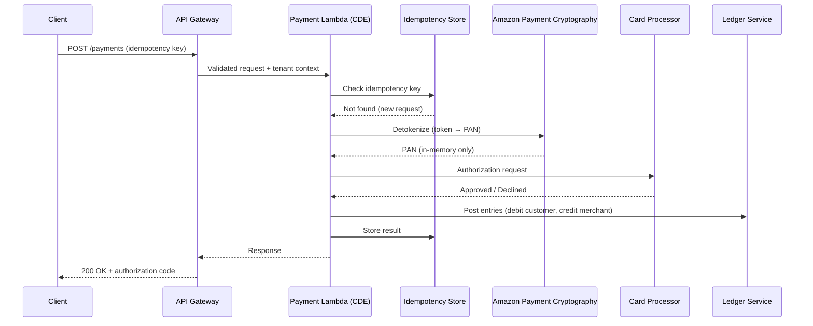
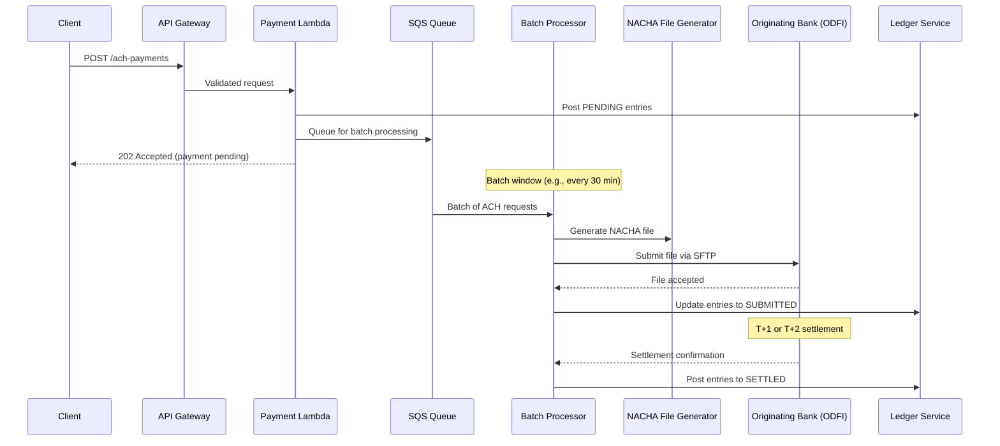

# Payments & Ledger Architecture

## Why This File Exists

Payments are the core workload for banking, neobanking, and payment SaaS platforms. Getting the ledger architecture wrong means financial inconsistency — which means regulatory findings, customer disputes, and potentially money loss. This file covers the architecture of payment processing and double-entry ledger systems on AWS for multi-tenant SaaS.

---

## Payment Rails — Understanding the Infrastructure

### Card Networks (Visa, Mastercard, Amex, Discover)
- Authorization → Clearing → Settlement cycle (T+1 to T+2)
- Your SaaS connects to card networks via a payment processor (Stripe, Adyen, FIS) or directly as an acquirer
- PCI-DSS scope: if PAN traverses your system, you're in scope (see `pii-financial-data-handling.md`)
- Amazon Payment Cryptography for HSM operations (PIN translation, CVV verification, tokenization)

### ACH / NACHA (US Domestic)
- Batch-based: files submitted in windows (next-day ACH, same-day ACH)
- NACHA file format: fixed-width records (File Header, Batch Header, Entry Detail, Addenda, Batch Control, File Control)
- Settlement: T+1 for same-day ACH, T+2 for standard ACH
- Returns: can arrive up to 60 days later (unauthorized returns)
- Key architectural requirement: handle returns gracefully — a settled payment can be reversed

### RTP (Real-Time Payments — The Clearing House)
- Irrevocable: once settled, cannot be reversed (no chargebacks, no returns)
- 24/7/365 availability requirement — your system must be always-on
- Settlement: immediate (seconds)
- Message format: ISO 20022 (see `open-banking-and-interop.md`)
- Request for Payment (RfP): payer-initiated or payee-requested

### FedNow (Federal Reserve)
- Instant payment rail operated by the Federal Reserve
- Similar to RTP: irrevocable, 24/7/365, ISO 20022 messages
- $500K per-transaction limit (subject to change)
- Financial institutions connect directly or via service providers

### Wire Transfers (Fedwire / CHIPS)
- High-value, same-day settlement
- Fedwire: operated by Federal Reserve, RTGS (Real-Time Gross Settlement)
- CHIPS: operated by The Clearing House, net settlement for large commercial payments
- Typically used for large B2B payments, real estate, securities settlement

### SWIFT (Cross-Border)
- Messaging network connecting 11,000+ financial institutions globally
- SWIFT MT messages (legacy) migrating to ISO 20022 (MX messages) by 2025
- SWIFT gpi: tracking for cross-border payments (end-to-end visibility)
- Correspondent banking model: your bank → correspondent → beneficiary bank

---

## Double-Entry Ledger Architecture

### The Fundamental Principle
Every financial transaction must be recorded as at least two entries that balance: a debit and a credit. The sum of all debits must equal the sum of all credits at all times. This is not optional — it's the basis of all financial accounting.

### Ledger Data Model

```
Account (represents a financial account — could be a customer, a liability, revenue, etc.)
├── account_id (PK)
├── tenant_id
├── account_type (asset, liability, equity, revenue, expense)
├── currency (ISO 4217)
├── status (active, frozen, closed)
└── created_at

Entry (individual debit or credit — immutable once written)
├── entry_id (PK)
├── tenant_id
├── transaction_id (FK — groups entries belonging to same transaction)
├── account_id (FK)
├── amount (always positive — direction indicated by type)
├── type (DEBIT or CREDIT)
├── currency
├── effective_date
├── created_at
└── idempotency_key

Transaction (groups entries that must balance)
├── transaction_id (PK)
├── tenant_id
├── idempotency_key (unique per tenant — prevents duplicate processing)
├── status (pending, posted, reversed, failed)
├── description
├── metadata (JSON — payment rail, reference numbers, etc.)
├── created_at
└── posted_at
```

### Immutability Rule
**Ledger entries are NEVER modified or deleted.** Corrections are recorded as new reversing entries. This is a regulatory requirement (SOX, GLBA record retention) and an accounting fundamental.

- Wrong amount posted? Create a reversing entry (debit becomes credit of same amount) + new correct entry
- Transaction disputed? Create reversal entries. Never delete the original.
- Tenant offboarded? Entries remain for retention period. Never purge active ledger data.


---

## Idempotency — Exactly-Once Payment Processing

### Why Idempotency Is Critical
Payment APIs are called over networks that can fail, timeout, or retry. Without idempotency, a network timeout on a payment request can result in the customer being charged twice. In financial services, "maybe we processed it twice" is not acceptable.

### Idempotency Key Pattern

```typescript
// Client sends an idempotency key with every payment request
// POST /v1/payments
// X-Idempotency-Key: pay_req_abc123_20240115_001

async function processPayment(request: PaymentRequest): Promise<PaymentResponse> {
  const idempotencyKey = `${request.tenantId}#${request.idempotencyKey}`;
  
  // Step 1: Check if this request was already processed
  const existing = await dynamodb.getItem({
    TableName: 'IdempotencyStore',
    Key: { pk: idempotencyKey },
  });
  
  if (existing.Item) {
    // Already processed — return the stored response (not reprocessed)
    return JSON.parse(existing.Item.response);
  }
  
  // Step 2: Claim the idempotency key (conditional write — prevents race conditions)
  try {
    await dynamodb.putItem({
      TableName: 'IdempotencyStore',
      Item: {
        pk: idempotencyKey,
        status: 'PROCESSING',
        created_at: Date.now(),
        ttl: Math.floor(Date.now() / 1000) + (24 * 60 * 60), // 24h TTL
      },
      ConditionExpression: 'attribute_not_exists(pk)', // fails if key already exists
    });
  } catch (e) {
    if (e.name === 'ConditionalCheckFailedException') {
      // Another invocation is processing — wait and return their result
      return await waitForResult(idempotencyKey);
    }
    throw e;
  }
  
  // Step 3: Process the payment (only reaches here once per idempotency key)
  const result = await executePayment(request);
  
  // Step 4: Store the result for future duplicate requests
  await dynamodb.updateItem({
    TableName: 'IdempotencyStore',
    Key: { pk: idempotencyKey },
    UpdateExpression: 'SET #s = :s, #r = :r',
    ExpressionAttributeNames: { '#s': 'status', '#r': 'response' },
    ExpressionAttributeValues: { ':s': 'COMPLETED', ':r': JSON.stringify(result) },
  });
  
  return result;
}
```

### DynamoDB for Idempotency Store
- Partition key: `{tenant_id}#{idempotency_key}` — naturally tenant-scoped
- TTL: 24 hours (or longer for ACH where returns can arrive days later)
- Conditional writes (ConditionExpression) prevent race conditions between retries

---

## Event Sourcing for Financial Transactions

### Why Event Sourcing for Finance
Traditional CRUD (update the balance) loses history. Event sourcing (append every event, derive state) preserves complete audit trail — which satisfies SOX, GLBA, and BSA/AML requirements.

**Event sourcing principle:** The ledger IS the event log. The current balance of an account is derived by replaying all entries for that account. No separate "balance" field that can drift from reality.

### Event Stream Architecture

```
Payment Request → Validation → Ledger Event Created (Kinesis/DynamoDB Stream)
                                        ↓
                              ┌─────────┴──────────┐
                              ↓                    ↓
                    DynamoDB (entries)    Kinesis → S3 (immutable archive)
                              ↓                    ↓
                    Balance Projection    Analytics / AML Monitoring
```

### CQRS (Command Query Responsibility Segregation)
- **Command side:** Writes to the ledger (append entries, create transactions). Enforces business rules (sufficient balance, transaction limits, KYC status).
- **Query side:** Reads balances, transaction history, statements. Built from projections of the event stream.
- **Why CQRS for payments:** The write path must be strongly consistent (double-spend prevention), but the read path can be eventually consistent (balance displayed might be 100ms behind — acceptable for most UIs).

---

## Payment Processing Architecture on AWS

### Synchronous Payment Flow (Card Authorization)



### Asynchronous Payment Flow (ACH)



---

## Multi-Tenant Payment Isolation

### One Tenant's Payment Failure Must Not Affect Others

**Isolation requirements:**
- Per-tenant payment queues (SQS): if Tenant A's payment processor is down, Tenant B's payments still process
- Per-tenant rate limiting: one tenant's spike doesn't exhaust shared rate limits
- Per-tenant circuit breakers: if Tenant A's processor returns errors, only Tenant A's circuit opens
- Per-tenant settlement reconciliation: each tenant reconciles independently

### Token Namespace Isolation
Each tenant's payment tokens must be scoped to that tenant:
- Token `tok_abc123` for Tenant A maps to PAN `4111...1111`
- Token `tok_abc123` for Tenant B either doesn't exist or maps to a DIFFERENT PAN
- Amazon Payment Cryptography key configuration: per-tenant encryption keys for token generation ensure namespace isolation

---

## Settlement and Reconciliation

### Settlement Architecture
- **End-of-day reconciliation:** Compare your ledger entries against the processor's settlement file
- **Discrepancy detection:** Flag mismatches (amount differences, missing transactions, duplicates)
- **Auto-reconciliation:** Match by transaction ID + amount. Flag exceptions for manual review.

```
Processor Settlement File (S3) → Lambda Parser → DynamoDB (settlement records)
                                                         ↓
                                              Lambda Reconciliation Engine
                                                         ↓
                                              ┌──────────┴──────────┐
                                              ↓                     ↓
                                    Matched (auto-close)   Exceptions (manual review queue)
```

### Multi-Tenant Reconciliation
- Each tenant reconciles against THEIR processor's settlement — not all tenants use the same processor
- Settlement files are per-tenant (S3 prefix: `settlements/{tenant_id}/{date}/`)
- Reconciliation reports are per-tenant and auditable (SOX evidence)

---

## Amazon Payment Cryptography

AWS's managed payment HSM service, PCI PTS HSM certified. Use for:

| Operation | Use Case |
|---|---|
| Key management | Generate, import, export payment cryptographic keys (BDK, DUKPT, ZPK) |
| PIN translation | Translate PIN blocks between encryption zones (acquirer → issuer) |
| CVV/CVC generation | Generate card verification values for issued cards |
| CVV/CVC validation | Verify CVV on incoming authorization requests |
| MAC generation/verification | Message authentication for financial messages |
| Tokenization | Generate and manage payment tokens (PAN → token mapping) |

**Multi-tenant key management:**
Each tenant (if they're an issuer or acquirer) has their own key hierarchy in Amazon Payment Cryptography. Keys are isolated per tenant — Tenant A's BDK cannot be used by Tenant B's operations.

---

## Chargeback and Dispute Management

### Architecture
```
Chargeback Notification (from processor/network)
    → SQS (per-tenant chargeback queue)
    → Lambda (parse, create case)
    → DynamoDB (dispute case store — per tenant)
    → Step Functions (dispute workflow: receive → investigate → respond → resolve)
    → Response to network (within timeline: 30-45 days depending on network)
```

**Multi-tenant:** Disputes are always tenant-scoped. Tenant A's disputes are never visible to Tenant B. Chargeback reason codes, response templates, and win/loss analytics are per-tenant.

---

## Common Mistakes

1. **Mutable ledger entries.** Never update or delete a ledger entry. Corrections are reversing entries. This is accounting 101 and a regulatory requirement.

2. **No idempotency on payment APIs.** Network retries WILL happen. Without idempotency keys, you WILL double-charge customers. This is the single most common payment engineering bug.

3. **Balance stored as a single field.** If your "balance" is a number that gets incremented/decremented, it will drift from reality over time. The balance should be derived from the sum of all ledger entries — event sourcing.

4. **Ignoring ACH returns.** An ACH payment that settles on Tuesday can be returned on Thursday (or 60 days later for unauthorized). Your system must handle returns gracefully — reverse the ledger entries, notify the merchant, potentially re-debit.

5. **Shared payment queue for all tenants.** If one tenant's processor is slow or erroring, the shared queue backs up for ALL tenants. Use per-tenant queues or at minimum per-tenant DLQs.

6. **Not reconciling daily.** If you don't reconcile your ledger against processor settlement files daily, discrepancies accumulate silently until a customer or auditor finds them.

7. **PAN in payment logs.** The payment Lambda that calls the processor must NEVER log the PAN. Log the token, the authorization code, the amount — never the card number.

---

## Discovery Questions for This Domain

**Payment rails:**
- Which payment rails do you support? (Card, ACH, RTP, FedNow, wire, SWIFT?)
- Do you connect directly to card networks (acquirer) or through a processor (Stripe, Adyen, FIS)?
- Do you process real-time payments (RTP/FedNow)? If so, what's your availability target? (24/7/365 required)

**Ledger:**
- Do you maintain a double-entry ledger, or is your transaction store single-entry?
- Are ledger entries immutable (append-only), or do you update them?
- How do you handle corrections and reversals?

**Idempotency:**
- Do your payment APIs support idempotency keys?
- What's the deduplication window? (24h? 7 days? Depends on payment rail)
- How do you handle the race condition when two retries arrive simultaneously?

**Multi-tenant:**
- Can one tenant's payment processing failure affect other tenants?
- Are payment queues shared or per-tenant?
- Do different tenants use different payment processors?

**Reconciliation:**
- Do you reconcile daily against processor settlement files?
- How are discrepancies handled? (Automated matching + exception queue?)
- Are reconciliation reports retained for SOX/audit evidence?

---

## References

- [Amazon Payment Cryptography](https://docs.aws.amazon.com/payment-cryptography/latest/userguide/what-is-payment-cryptography.html)
- [AWS Financial Services Industry Lens](https://docs.aws.amazon.com/wellarchitected/latest/financial-services-industry-lens/financial-services-industry-lens.html)
- [Building Payment Solutions on AWS](https://aws.amazon.com/financial-services/payments/)
- [NACHA Operating Rules](https://www.nacha.org/rules)
- [The Clearing House — RTP Network](https://www.theclearinghouse.org/payment-systems/rtp)
- [FedNow Service](https://www.frbservices.org/financial-services/fednow)
- [ISO 20022 Standard](https://www.iso20022.org/)
- [PCI-DSS v4.0 — Requirement 3 (Protect Stored Account Data)](https://www.pcisecuritystandards.org/document_library/)
