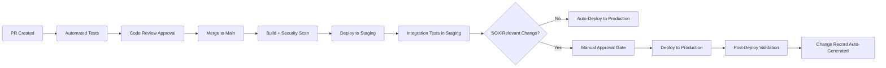

# Resilience & Deployment

## Why This File Exists

Financial services SaaS has elevated availability requirements — real-time payment rails require 99.99% uptime (< 4.3 min/month downtime), SOX mandates documented change control for financial systems, and regulators expect tested disaster recovery capabilities. This file covers deployment patterns and resilience architecture.

---

## Availability Targets by Workload

| Workload | Target | DR Strategy | Justification |
|---|---|---|---|
| Real-time payments (RTP, FedNow) | 99.99% | Multi-Region active-active | Rail availability mandate |
| Card authorization | 99.95% | Multi-AZ active-active | Revenue impact of downtime |
| ACH batch processing | 99.9% | Multi-AZ + retry | Batch windows allow recovery |
| Open banking APIs (PSD2) | 99.9% | Multi-AZ | PSD2 dedicated interface availability mandate |
| Lending / servicing | 99.9% | Multi-AZ + backup | Business day SLA |
| Admin / reporting | 99.5% | Multi-AZ | Non-critical path |

---

## Multi-AZ / Multi-Region Patterns

### Multi-AZ (Minimum for All Financial Workloads)
- Aurora Multi-AZ: automatic failover in < 30 seconds
- DynamoDB: Global Tables for multi-region; standard tables are always multi-AZ
- Lambda: automatically multi-AZ within a region
- ECS/EKS: spread tasks across AZs via service scheduler
- ElastiCache: Multi-AZ with automatic failover

### Multi-Region (For Payment-Critical Services)
When 99.99% is required and single-region failure is unacceptable:

```
Region A (Primary)                    Region B (DR / Active-Active)
┌────────────────────┐               ┌────────────────────┐
│  Route 53 (health) │               │  Route 53 (health) │
│  API Gateway       │               │  API Gateway       │
│  Lambda/ECS        │               │  Lambda/ECS        │
│  DynamoDB Global   │◄── replication──►│  DynamoDB Global   │
│  Aurora Global     │◄── replication──►│  Aurora Global     │
└────────────────────┘               └────────────────────┘
```

**DynamoDB Global Tables:** Active-active, sub-second replication. Best for session state, idempotency store, real-time lookups.
**Aurora Global Database:** Read replicas in DR region, < 1 second replication lag. Promote to primary in < 1 minute.

### Cell-Based Architecture (For Large Payment Platforms)
When serving hundreds of tenants with high transaction volumes, consider cell-based architecture:
- Each cell is a self-contained deployment serving a subset of tenants
- Cell failure impacts only the tenants in that cell (blast radius reduction)
- New tenants assigned to cells with available capacity
- Route 53 / API Gateway routes to correct cell based on tenant ID

---

## SOX Change Control in CI/CD

### The Tension
SOX requires documented, approved change control for financial systems. SaaS requires rapid, continuous deployment. These are reconcilable.

### Compliant CI/CD Pipeline



### Change Classification

| Class | Criteria | Approval | Deployment |
|---|---|---|---|
| Standard | Pre-assessed low risk (dependency patches, docs, non-functional) | Auto-approved by pipeline | Automatic |
| Normal | Feature changes, bug fixes, config changes | PR approval + team lead | Semi-automatic (approval gate) |
| Major | Architecture changes, DB migrations, security model changes | CAB or equivalent review | Scheduled window |
| Emergency | Production-down, security vulnerability, data integrity | Expedited approval + post-hoc review within 48h | Immediate (break-glass) |

### SOX Evidence from CI/CD
The pipeline itself generates SOX audit evidence:
- **Who:** PR author + approver identities (from Git + CI/CD)
- **What:** Diff of changes, affected services
- **When:** Timestamps for each pipeline stage
- **Why:** PR description, linked ticket/requirement
- **Testing:** Automated test results (pass/fail)
- **Approval:** Pipeline approval gate sign-off

Store all pipeline artifacts in S3 with Object Lock (7-year retention for SOX).

---

## Zero-Downtime Deployments

### Blue/Green Deployment
- Two identical environments (blue = current, green = new version)
- Deploy to green, run smoke tests, switch traffic
- If issues: switch back to blue immediately
- **Best for:** Major version changes, database migration changes

### Canary Deployment
- Deploy new version to a small percentage of traffic (5-10%)
- Monitor error rates and latency for canary vs. baseline
- If healthy: gradually increase to 100%
- If unhealthy: automatic rollback
- **Best for:** Routine releases, feature changes

### Rolling Deployment (ECS/EKS)
- Replace instances one at a time
- Each new instance health-checked before proceeding
- **Best for:** Container workloads with multiple replicas

### Payment Service Deployment Constraints
- Never deploy during peak payment windows (payroll days, month-end) unless emergency
- Canary must include real transaction processing (not just health checks)
- Rollback must be automatic if payment success rate drops below threshold
- Idempotency ensures no duplicate processing during deployment switchover

---

## Disaster Recovery Testing

### Testing Cadence
| Test | Frequency | Scope |
|---|---|---|
| Automated failover (AZ) | Monthly | Aurora failover, ECS task redistribution |
| Manual region failover | Quarterly | Full Region B promotion exercise |
| Backup restore | Monthly | Restore DynamoDB PITR, Aurora snapshot, S3 objects |
| Chaos engineering | Monthly | Inject failures in non-production, measure recovery |
| Full DR drill | Semi-annually | Simulate region loss, document RTO achieved |

### DR Test Evidence (for Examiners)
Bank examiners and FFIEC auditors will ask for DR test evidence:
- Test plan (pre-documented)
- Test execution log (timestamped steps)
- RTO achieved vs. RTO target
- Issues encountered and resolution
- Sign-off by responsible party

---

## Common Mistakes

1. **No change approval gate for production.** SOX requires documented approval. A pipeline that deploys to production on merge without any approval gate is a finding.

2. **Deploying during payment peaks.** A failed deployment during payroll processing affects millions of consumers. Use deployment windows or canary with automatic rollback.

3. **DR not tested.** A DR plan that's never tested is not a plan — it's a hope. Test quarterly minimum, document results.

4. **Single-region for real-time payments.** RTP/FedNow require 24/7/365 availability. A single-region architecture has a single point of failure. Multi-region or multi-AZ with proven failover.

5. **No rollback capability.** Every deployment must be rollbackable. If your database migration is irreversible, you need a forward-fix strategy and it must be tested.

---

## Discovery Questions for This Domain

- What are your contractual availability targets per service?
- Do you process real-time payments requiring 99.99%+ availability?
- Is your CI/CD pipeline generating SOX-compliant change evidence?
- How do you handle deployments — blue/green, canary, rolling?
- When did you last test DR failover? What was the actual RTO?
- Do you have deployment windows, or do you deploy any time?

---

## References

- [SaaS Lens — Reliability Pillar](https://docs.aws.amazon.com/wellarchitected/latest/saas-lens/reliability-pillar.html)
- [AWS Well-Architected — Disaster Recovery](https://docs.aws.amazon.com/whitepapers/latest/disaster-recovery-workloads-on-aws/disaster-recovery-workloads-on-aws.html)
- [Cell-Based Architecture](https://docs.aws.amazon.com/wellarchitected/latest/reducing-scope-of-impact-with-cell-based-architecture/reducing-scope-of-impact-with-cell-based-architecture.html)
- [AWS Resilience Hub](https://docs.aws.amazon.com/resilience-hub/latest/userguide/what-is.html)
- [Blue/Green Deployments on AWS](https://docs.aws.amazon.com/whitepapers/latest/overview-deployment-options/bluegreen-deployments.html)
