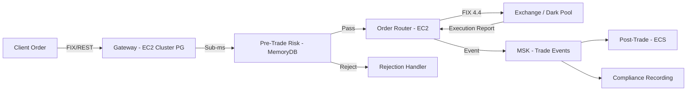

# Trading & Market Data

## Segment Overview

Capital markets SaaS includes multi-tenant platforms for brokerage, order management systems (OMS), execution management systems (EMS), market data distribution, post-trade processing, and portfolio management. Tenants are broker-dealers, trading firms, asset managers, and market makers.

This segment has unique architectural concerns: microsecond-level latency requirements, FIX protocol support, strict regulatory record retention (SEC 17a-4), silo isolation for competing firms, and massive real-time data throughput for market feeds.

---

## Low-Latency Trading Architecture on AWS

### Compute for Latency-Sensitive Workloads

| Requirement | AWS Service | Configuration |
|---|---|---|
| Lowest latency (< 100μs) | EC2 with Enhanced Networking | C6in/C7gn instances, ENA Express, Placement Groups (cluster) |
| Sub-millisecond messaging | Amazon MemoryDB (Redis) | In-memory order book, position cache |
| High-throughput event streaming | Amazon MSK (Kafka) | Dedicated brokers, io2 EBS, no cross-AZ replication for latency |
| Network optimization | Elastic Fabric Adapter (EFA) | For HPC-style inter-node communication |
| Co-location equivalent | AWS Local Zones / Outposts | Near exchange proximity (for DMA strategies) |

### Architecture Pattern — Order Execution Path



**Key design decisions:**
- Order execution path is synchronous and must complete in < 1ms for competitive electronic trading
- Pre-trade risk checks (position limits, credit checks, fat finger limits) use in-memory cache (MemoryDB) — no database round-trip
- Order book and position data in MemoryDB for sub-millisecond reads
- MSK (Kafka) for durable event streaming of trade events to downstream systems
- Post-trade processing is asynchronous — milliseconds to seconds acceptable

### Placement Groups and Network Optimization
- **Cluster placement group:** All order-path instances in the same AZ, same rack for lowest inter-node latency
- **Enhanced Networking (ENA):** Up to 200 Gbps bandwidth, reduced jitter
- **Jumbo frames:** 9001 MTU within VPC for fewer packets per message
- **Kernel bypass (DPDK):** For the most latency-sensitive components, bypass the kernel network stack

---

## Market Data Ingestion

### Real-Time Market Data Feeds

```
Exchange Feed (co-lo / cross-connect)
    → NLB (TCP/UDP) or Direct Connect
    → EC2 Feed Handler (decode exchange-specific protocol)
    → Normalization (convert to internal format)
    → MemoryDB (current quotes, order book snapshots)
    → MSK/Kinesis (tick stream for persistence and downstream)
    → Per-tenant entitlement filter
    → Client distribution (WebSocket / FIX)
```

**Multi-tenant market data:**
- Market data has entitlement licensing — not all tenants are entitled to all data
- Per-tenant entitlement filter: based on tenant's market data licenses, filter the stream before delivery
- Shared feed infrastructure (pool) with per-tenant entitlement filtering is the standard pattern
- Market data is NOT proprietary to a tenant (it's exchange data) — pool is appropriate here

### Market Data Storage (Time-Series)

| Data Type | Volume | Storage | Query Pattern |
|---|---|---|---|
| Tick data (every quote/trade) | TB/day | S3 (Parquet) + Athena | Historical backtesting, compliance |
| OHLCV (bars) | GB/day | DynamoDB or Timestream | Charting, technical analysis |
| Order book snapshots | GB/day | S3 (Parquet) | Market microstructure research |
| Reference data (instruments) | MB/day | DynamoDB | Real-time lookups |

---

## FIX Protocol on AWS

The Financial Information eXchange (FIX) protocol is the standard for electronic trading communication.

### FIX Message Types
| Message | Type | Purpose |
|---|---|---|
| New Order Single | D | Submit new order |
| Execution Report | 8 | Order status, fills, rejects |
| Order Cancel Request | F | Cancel existing order |
| Order Cancel/Replace | G | Modify existing order |
| Market Data Request | V | Subscribe to market data |
| Market Data Snapshot | W | Market data update |
| Logon | A | Session establishment |
| Heartbeat | 0 | Session keepalive |

### FIX Gateway Architecture
- **NLB (Network Load Balancer):** TCP pass-through for FIX connections (no HTTP — FIX is raw TCP)
- **EC2 FIX Engine:** Open-source (QuickFIX) or commercial FIX engine running on EC2
- **Session management:** Each client (tenant) has a FIX session with unique SenderCompID/TargetCompID
- **Persistence:** FIX message store for guaranteed delivery and gap-fill (DynamoDB or local SSD)
- **Multi-tenant:** Each tenant has their own FIX session(s). Session credentials and CompIDs are tenant-scoped.

### Drop Copy
A read-only copy of all executions sent to a compliance feed:
- Every execution report → MSK topic → S3 (immutable, Object Lock)
- Used for: trade surveillance, best execution analysis, regulatory reporting
- Retention: SEC 17a-4 requires 6 years (3 years immediately accessible)

---

## Order Management System (OMS) Multi-Tenant Patterns

### Why Silo for Competing Trading Firms
**Non-negotiable:** Competing broker-dealers or trading firms sharing pool infrastructure is unacceptable.
- Order flow information is competitively sensitive
- Position data reveals trading strategy
- FINRA and SEC expect clear separation between competing firms
- A bug exposing one firm's orders to another is a regulatory violation AND a business-ending trust breach

### Per-Tenant OMS Architecture
```
Tenant A (Broker-Dealer A)          Tenant B (Broker-Dealer B)
┌──────────────────────┐           ┌──────────────────────┐
│  FIX Gateway (EC2)    │           │  FIX Gateway (EC2)    │
│  OMS Engine (EC2/ECS) │           │  OMS Engine (EC2/ECS) │
│  MemoryDB (positions) │           │  MemoryDB (positions) │
│  Aurora (orders/fills)│           │  Aurora (orders/fills)│
│  MSK (trade events)   │           │  MSK (trade events)   │
└──────────────────────┘           └──────────────────────┘
         ↑                                    ↑
         └────────── Shared Control Plane ────┘
              (tenant mgmt, billing, deployment)
```

### Shared Components (Pool — Acceptable)
- Market data feeds (after entitlement filtering)
- Reference data (instrument master, exchange calendars)
- Control plane (tenant management, billing, deployment)
- Monitoring infrastructure (with per-tenant metric isolation)

---

## Pre-Trade Risk Controls

### Required Checks (Before Order Reaches Market)
| Check | Purpose | Latency Budget |
|---|---|---|
| Position limit | Prevent over-concentration | < 100μs |
| Credit/buying power | Prevent overextension | < 100μs |
| Fat finger | Reject orders 10x+ normal size | < 50μs |
| Price collar | Reject orders far from market | < 50μs |
| Restricted list | Block trading in restricted securities | < 100μs |
| Market access controls | SEC Rule 15c3-5 compliance | < 200μs total |

**Architecture:** All checks against in-memory data (MemoryDB). NO database round-trips in the order path. Position and credit data replicated from authoritative source to MemoryDB asynchronously.

### SEC Rule 15c3-5 (Market Access Rule)
Broker-dealers providing market access must implement pre-trade risk controls:
- Financial (credit/capital thresholds)
- Regulatory (restricted securities, erroneous orders)
- Must be under the broker-dealer's direct and exclusive control
- Cannot be overridden by the customer

**Multi-tenant:** Each tenant (broker-dealer) has their own risk parameters. One tenant's fat-finger limit is independent of another's. Store per-tenant risk config in DynamoDB, cache in MemoryDB.

---

## Post-Trade Processing

### Trade Confirmation, Allocation, Settlement

```
Execution Report (from exchange)
    → MSK (trade events stream)
    → Lambda: Trade confirmation to client
    → Lambda: Allocation (split block trade among accounts)
    → Lambda: Settlement instruction generation
    → SWIFT/FIX: Send to DTCC/DTC for clearing
    → DynamoDB: Update position and P&L
    → S3: Archive trade record (SEC 17a-4 retention)
```

### DTCC/DTC Integration
- Trades in US equities settle T+1 (since May 2024)
- NSCC (subsidiary of DTCC) provides central counterparty clearing
- Integration typically via SWIFT FIN messages or proprietary APIs
- SaaS platform generates settlement instructions on behalf of tenant broker-dealers

---

## MiFID II Compliance (EU/UK)

### Best Execution
- Record sufficient data to demonstrate best execution on every order
- Pre-trade: quotes from multiple venues considered
- Post-trade: execution quality reports (RTS 27/28 — venue statistics, execution quality)
- Retention: 5 years

### Transaction Reporting
- Report trades to Approved Reporting Mechanism (ARM) by T+1
- Fields: instrument, venue, time (microsecond precision), price, quantity, buyer/seller identifiers
- Multi-tenant: each tenant (investment firm) reports under their own MiFID entity

### Record Retention
- All communications (email, chat, phone) related to trading: 5 years
- Order and execution records: 5 years
- Best execution data: 5 years

---

## SEC Reg SCI (Systems Compliance and Integrity)

Applies to SCI entities: national securities exchanges, clearing agencies, certain ATSs, plan processors, and certain exempt clearing agencies. If your SaaS platform is used by an SCI entity, these requirements flow to you.

**Key requirements:**
- **SCI Systems:** Systems that directly support trading, clearance, settlement, order routing, market data
- **SCI Review:** Annual comprehensive review of SCI systems
- **Business continuity:** Backup and recovery within defined RTOs
- **Capacity planning:** Systems must have capacity to handle peak volumes
- **Change management:** All changes to SCI systems must follow documented change control

---

## Common Mistakes

1. **Pool model for competing trading firms.** Order flow, position data, and trading strategy are competitively sensitive. Silo is mandatory for competing broker-dealers.

2. **Database in the order execution path.** Any synchronous database call in the order path adds milliseconds of latency. Use in-memory stores (MemoryDB) for pre-trade checks.

3. **Not retaining trade records for 6 years.** SEC 17a-4 requires broker-dealers to retain order and execution records. S3 Object Lock in Compliance Mode with 6-year retention.

4. **Single-AZ for trading infrastructure.** A single-AZ failure takes down all tenants. But cluster placement groups are single-AZ. Resolution: active-active across two AZs with failover in < 1 second; accept slightly higher latency for the standby path.

5. **No drop copy.** Regulators expect a complete, independent record of all executions. A drop copy to immutable storage is the standard pattern.

6. **Market data entitlements not enforced.** Delivering market data to a tenant without proper exchange licensing exposes you to exchange audit risk and contract violations.

---

## Discovery Questions for This Domain

**Trading infrastructure:**
- What asset classes do your tenants trade? (Equities, options, futures, fixed income, crypto, FX?)
- What's the latency requirement? (< 1ms competitive trading, < 100ms retail, < 1s advisory?)
- Do you connect directly to exchanges or route through other broker-dealers?

**FIX:**
- Do you need FIX connectivity? Which version (4.2, 4.4, 5.0)?
- How many concurrent FIX sessions per tenant?
- Do you need drop copy (compliance recording of all executions)?

**Multi-tenant:**
- Are your tenants competing broker-dealers? (If yes: silo mandatory for order/position data)
- How many tenants? (Determines whether silo is operationally feasible)
- Do tenants share market data infrastructure?

**Compliance:**
- Are tenants SEC-registered broker-dealers (SEC 17a-4 retention applies)?
- Are tenants subject to MiFID II (EU/UK)? Transaction reporting, best execution?
- Are any tenants SCI entities under Reg SCI?
- Do you need FINRA trade surveillance capabilities?

---

## References

- [AWS for Capital Markets](https://aws.amazon.com/financial-services/capital-markets/)
- [Low Latency Trading on AWS](https://aws.amazon.com/blogs/industries/low-latency-trading-on-aws/)
- [SEC Rule 17a-4 — Record Retention](https://www.sec.gov/investment/amendments-electronic-recordkeeping-requirements-broker-dealers)
- [SEC Rule 15c3-5 — Market Access](https://www.sec.gov/rules/final/2010/34-63241.pdf)
- [FINRA Rules](https://www.finra.org/rules-guidance/rulebooks/finra-rules/)
- [MiFID II / MiFIR (ESMA)](https://www.esma.europa.eu/policy-rules/mifid-ii-and-mifir/)
- [FIX Protocol](https://www.fixtrading.org/standards/)
- [DTCC Clearing and Settlement](https://www.dtcc.com/)
